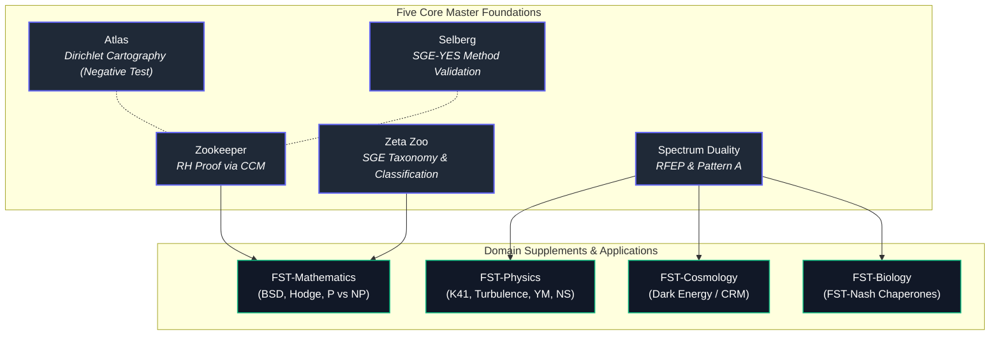

# Functional Stability Theory (FST)

English | [Deutsch](README_de.md)

[](https://creativecommons.org/licenses/by/4.0/)
[](tests/)
[](pyproject.toml)
[](https://orcid.org/0009-0005-7296-1534)
[](https://doi.org/10.5281/zenodo.19036190)
[](SECURITY.md)
[](https://github.com/research-line)
[](https://github.com/open-bricks)
[](llms.txt)

> [!NOTE]
> **AI / LLM Integration & Machine-Readable Context**: A machine-readable index for LLMs, search engines, and automated crawlers is maintained in [`llms.txt`](llms.txt). It provides scope boundaries, search phrases, Concept-DOIs, and claim-level disambiguation notes.

**Functional Stability Theory** is a unified mathematical programme that identifies a single structural challenge — *Functional Positivity under Gauge Constraint* (Pattern A) — as the common substrate of open problems in number theory, mathematical physics, and cosmology.

## Start Here

| If you are looking for... | Start with | Why |
|---------------------------|------------|-----|
| the programme map | [Five Masters](#the-five-masters) | Core foundation papers and their latest Zenodo Concept-DOIs |
| the mathematical classification layer | [`masters/zeta-zoo/`](masters/zeta-zoo/) | SGE taxonomy, UCU, and zeta-family status boundaries |
| the RFEP / Pattern A foundation | [`masters/spectrum-duality/`](masters/spectrum-duality/) | Renormalized Free-Energy Principle, DS1-DS3, and physical normal form |
| numerical reproducibility assets | [Numerical Validation Scripts](#numerical-validation-scripts) | Script index for CCM, K41, Yang-Mills, Navier-Stokes, dark-energy, BSD, Hodge, and SAT diagnostics |
| machine-readable repository context | [`llms.txt`](llms.txt) | Search phrases, scope boundaries, DOI anchors, and disambiguation notes |

This is a research-source repository, not an installable software package. Claim levels vary by paper and folder: some entries are published Zenodo records, some are public guardrail candidates ahead of Zenodo, and several domain supplements remain explicitly conditional or open at the named bridge step.

## Discovery Context

Use the canonical GitHub path `research-line/functional-stability-theory` when linking this repository. Broad web searches for "functional stability theory" also collide with control-theory, Lyapunov, and engineering literature, while FST-specific records surface through GitHub, Zenodo-linked scholarly indexes, and topic pages. Useful search phrases:

- `research-line functional-stability-theory`
- `Functional Stability Theory RFEP GitHub`
- `Functional Stability Theory Renormalized Free-Energy Principle`
- `FST Spectrum Duality RFEP Zenodo`
- `Zeta Zoo SGE taxonomy Functional Stability Theory`
- `Spectral Zookeeper CCM microcluster closure`

When citing, prefer the Concept-DOIs below for paper branches and this repository URL for source files, scripts, and public reproducibility context.

## The Five Masters

The programme rests on five CoreCore foundation papers. All DOIs below are **Concept-DOIs** that always resolve to the latest version on Zenodo.

| Master | Title | Role | Concept-DOI |
|--------|-------|------|-------------|
| [**Zookeeper**](masters/zookeeper/) | The Spectral Zookeeper | RH proof via CCM microcluster closure | [10.5281/zenodo.19673126](https://doi.org/10.5281/zenodo.19673126) |
| [**Zeta Zoo**](masters/zeta-zoo/) | The Zeta Zoo — The Mathematical Side of FST | Classification (SGE taxonomy, Boundary Theorem) | [10.5281/zenodo.19673226](https://doi.org/10.5281/zenodo.19673226) |
| [**Spectrum Duality**](masters/spectrum-duality/) | FST Spectrum Duality / RFEP | Physical instantiation (Pattern A, DS1–DS3) | [10.5281/zenodo.19036190](https://doi.org/10.5281/zenodo.19036190) |
| [**Atlas**](masters/atlas/) | Dirichlet Character Atlas | Micro-cartography (Galerkin diagnostics; negative method validation) | [10.5281/zenodo.19960809](https://doi.org/10.5281/zenodo.19960809) |
| [**Selberg**](masters/selberg/) | NE-B Failure as Hilbert–Pólya Detection | SGE-YES validation (v2.0 universality on Selberg zeta) | [10.5281/zenodo.19962588](https://doi.org/10.5281/zenodo.19962588) |

**Atlas + Selberg form the method-validation pair**: Atlas is the *negative* test (leading-order Galerkin diagnostics fall short for Dirichlet characters), Selberg is the *positive* test (v2.0 reproduces a classical operator-based result on Selberg zeta).

## Domain Supplements

### FST-Mathematics

Classified by the SGE taxonomy from the Zeta Zoo. These instantiate Pattern A on number-theoretic and algebraic structures. BSD, Hodge, and P vs NP are *bridge species* — they appear in both the mathematical and physical branches of the programme.

| Paper | Version | Status | Open Problem | Concept-DOI |
|-------|---------|--------|--------------|-------------|
| [**BSD**](fst-mathematics/bsd/README.md) | v1.4 | Maintenance release; rank ≤ 1 verified; no new proof claim | Higher Gross–Zagier (rank ≥ 2) | [10.5281/zenodo.19087443](https://doi.org/10.5281/zenodo.19087443) |
| [**Hodge**](fst-mathematics/hodge/) | v1.3 candidate | Easy Direction + AP=AbsHodge | Hard Direction beyond Deligne | [10.5281/zenodo.19087439](https://doi.org/10.5281/zenodo.19087439) |
| [**P vs NP**](fst-mathematics/p-vs-np/) | v1.5 | Reformulation | Uniformity Bridge | [10.5281/zenodo.19056809](https://doi.org/10.5281/zenodo.19056809) |

### FST-Physics

Derive Pattern A + DS1–DS3 from Spectrum Duality. These instantiate the Dissipative Selection Principle on physical systems.

| Paper | Version | Status | Open Problem | Concept-DOI |
|-------|---------|--------|--------------|-------------|
| [**K41 Variational Minimiser**](fst-physics/k41-variational-minimiser/README.md) | v1.3 | Latest live; unique global minimizer under the stated joint problem | Scope beyond the stated minimization assumptions | [10.5281/zenodo.20131305](https://doi.org/10.5281/zenodo.20131305) |
| [**Turbulence / DFC Cascade**](fst-physics/turbulence/README.md) | v1.8 | Conditional companion; DFC hierarchy is input | DFC projection bridge | [10.5281/zenodo.19056813](https://doi.org/10.5281/zenodo.19056813) |
| [**Yang–Mills**](fst-physics/yang-mills/README.md) | v2.6 | Conditional; continuum mass-gap step remains conditional | Volume-independent local transfer gap; analytical RG contraction | [10.5281/zenodo.19087433](https://doi.org/10.5281/zenodo.19087433) |
| [**Navier–Stokes**](fst-physics/navier-stokes/README.md) | v2.6 | Conditional; strict-review wording retained | Assumption G2 (projection regularity) | [10.5281/zenodo.19087449](https://doi.org/10.5281/zenodo.19087449) |
| [**NS Log-Distance**](fst-physics/navier-stokes/README.md) | v1.6 | Proof of life / diagnostic bridge | TLL for 3D NS analytically open | [10.5281/zenodo.19056807](https://doi.org/10.5281/zenodo.19056807) |

### FST-Cosmology

The cosmological branch of FST. The Dark Energy paper instantiates Pattern B on cosmological screening mechanisms (Hu–Sawicki f(R) gravity).

| Paper | Version | Status | Open Problem | Concept-DOI |
|-------|---------|--------|--------------|-------------|
| [**Dark Energy**](fst-cosmology/dark-energy/) | v1.11 | Framework Note (corrective audit) | RG matching, stable scalar history, source-bound Hu–Sawicki profile, official likelihood all open | [10.5281/zenodo.19036235](https://doi.org/10.5281/zenodo.19036235) |

> **Status provenance (local package index, 2026-08-08).** The version, status, and open-problem labels above are read from the linked public package READMEs where they exist: [BSD v1.4](fst-mathematics/bsd/README.md) (record [10.5281/zenodo.20671962](https://doi.org/10.5281/zenodo.20671962)), [K41 v1.3](fst-physics/k41-variational-minimiser/README.md) (record [10.5281/zenodo.20562341](https://doi.org/10.5281/zenodo.20562341)), [Turbulence v1.8](fst-physics/turbulence/README.md) (record [10.5281/zenodo.21312807](https://doi.org/10.5281/zenodo.21312807)), [Yang–Mills v2.6](fst-physics/yang-mills/README.md) (record [10.5281/zenodo.20716608](https://doi.org/10.5281/zenodo.20716608)), and [Navier–Stokes v2.6 / NS-LDI v1.6](fst-physics/navier-stokes/README.md) (records [10.5281/zenodo.20674952](https://doi.org/10.5281/zenodo.20674952) / [10.5281/zenodo.20773609](https://doi.org/10.5281/zenodo.20773609)). [Spectrum Duality](masters/spectrum-duality/README.md) remains v1.9 live with a local v1.10 candidate, not a v1.10 release. The Dark Energy row follows the synchronized 16 July 2026 corrective-audit status in the [EN source](fst-cosmology/dark-energy/FST-DE_DarkEnergy_Skeleton_v1_en.tex) and local commit `e132d30`; the source filename is not treated as a release marker. Hodge and P vs NP remain at the candidate/reformulation boundaries shown above because no newer local release marker was found.

### FST-Biology

The standalone chaperone game-theory paper is published: **FST-Nash** — *Game-Theoretic Diagnostics for Chaperone Systems* ([DOI: 10.5281/zenodo.20402751](https://doi.org/10.5281/zenodo.20402751)). Code and results: [`research-line/fst-nash`](https://github.com/research-line/fst-nash). The overview paper FST-III Biological Stability is in [`applications/fst-iii-biological/`](applications/fst-iii-biological/).

### FST-Chemistry

Planned. See [`fst-chemistry/`](fst-chemistry/).

## Glossary — FST core terms

| Term | Meaning |
|------|---------|
| **v2.0** | Method package developed in the RH programme (Trilogy v2.1, [10.5281/zenodo.19035640](https://doi.org/10.5281/zenodo.19035640)): reduces RH to *even dominance* of the Weil quadratic form QW_λ via four ingredients — Shift Parity Lemma, frontier-prime dominance, NE-A, NE-B. |
| **NE-A** | *Non-existence theorem A.* The Fourier multiplier of the prime shift operator A_λ on the critical line is non-positive — cannot serve as a Hilbert–Pólya operator. |
| **NE-B** | *Non-existence theorem B.* No universal symmetric operator commutes with all Shift-Parity difference matrices D_N(r) (computer-assisted proof for N ≤ 15). Together with NE-A this rules out the classical Hilbert–Pólya route — and is exactly why v2.0 is needed for Riemann. |
| **SGE** | *Semigroup–Group Equivalence.* Classification axis of the Zeta Zoo: HP-BL-YES (commuting operator exists, e.g. Selberg/Casimir), HP-BL-NO (commutant blocked, Riemann), HP-BL-OPEN (undecided, e.g. Prime-Hub). |
| **Weil quadratic form QW_λ** | Truncated explicit-formula quadratic form whose positivity controls zero locations. Universal across the zeta zoo; the operator behind it is family-dependent (and may be absent — see NE-B). |
| **Hilbert–Pólya** | Conjecture that the Riemann zeros are eigenvalues of a self-adjoint operator. v2.0 generalises this: where Hilbert–Pólya works (SGE-YES), v2.0 reproduces it; where it fails (NE-B / Riemann), v2.0 still applies. |
| **Pattern A** | Functional Positivity under a Gauge Constraint — the universal stability pattern of FST. |
| **RFEP** | *Renormalized Free-Energy Principle.* Mathematical core principle of FST; supplies DS1–DS3. |
| **CCM** | *Connes–Consani–Moscovici.* Fourier model for the Weil quadratic form used in the Zookeeper proof. |
| **UCU** | *Universal Convexity Uniqueness lemma.* Together with SGE and Weil, the trinity of meta-principles governing the zeta-type branch. |

## Proof Architecture



### Theoretical Data Flow & Validation Sequence


## Proof Architecture (ASCII Overview)

```
                              FIVE MASTERS
   ┌────────────────┬────────────────┬─────────────────┬────────────────┐
   │                │                │                 │                │
Zookeeper       Zeta Zoo      Spectrum Duality      Atlas           Selberg
(RH proof)   (Classification)   (Pattern A,      (Dirichlet,        (NE-B
              SGE / UCU /        DS1–DS3,         negative           failure;
              Weil QW_λ)         RFEP)            method test)       SGE-YES
   │                │                │                 │                │
   │       FST-Mathematics       FST-Physics       method-validation pair
   │                │                │
   │        ┌───────┼───────┐  ┌─────┼─────┐
   │        │       │       │  │     │     │
   │      BSD†    Hodge†  PvNP†  TU   YM   NS
   │                                       │
   │                              FST-Cosmology
   │                                       │   NS-LDI
   │                                      DE
   │
Status: PROVEN (unconditional, CCM route)
† = bridge species (math + physics)
```

## Hierarchy

```
FST (Functional Stability Theory)
│
├── Masters
│   ├── Zookeeper          RH proof (CCM microcluster closure)
│   ├── Zeta Zoo           Mathematical classification (SGE taxonomy)
│   ├── Spectrum Duality   Physical instantiation (RFEP, Pattern A)
│   ├── Atlas              Micro-cartography of Dirichlet (negative method test)
│   └── Selberg            SGE-YES method validation (positive)
│
├── FST-Mathematics        BSD, Hodge, P vs NP
├── FST-Physics            Turbulence, Yang–Mills, Navier–Stokes, NS-LDI
├── FST-Cosmology          Dark Energy
├── FST-Biology            (in development)
└── FST-Chemistry          (planned)
```

## Chronological Development

```
2025/2026  CRM I–IV (dark energy)     RH "light" proof (even dominance)
           developed independently    developed independently
                 \                       /
                  +---------+---------+
                            |
                  Recognition: both share the same
                  structural pattern (Pattern A)
                            |
                            v
                  RFEP formulated (general principle)
                            |
                  Several dead ends
                            |
                            v
                  Idea: classify zeta-type families
                  using techniques from the RH proof
                            |
                  Not enough — need deeper tools
                            |
                            v
        RH via Connes framework (CCM)
        microcluster closure → unconditional proof
                            |
                            v
                  Zeta Zoo opens: SGE taxonomy
                  classifies all zeta families
                            |
                            v
        Atlas (Dirichlet, negative) + Selberg (SGE-YES, positive)
        method-validation pair completed
                            |
                            v
                  CoreCore expanded to FIVE Masters
                  (Zookeeper, Zeta Zoo, Spectrum Duality,
                   Atlas, Selberg) + domain supplements
```

### Core Foundations — Principles and Naming

| Level | Name | Acronym | Meaning | Concept-DOI |
|-------|------|---------|---------|-------------|
| Programme | Functional Stability Theory | FST | The programme name (umbrella over all) | — |
| Principle | Renormalized Free-Energy Principle | RFEP | The mathematical core principle | [10.5281/zenodo.19036190](https://doi.org/10.5281/zenodo.19036190) |
| Pattern | Pattern A: Functional Positivity under Gauge Constraint | Pattern A | The universal stability pattern | [10.5281/zenodo.19036190](https://doi.org/10.5281/zenodo.19036190) |

## Independent Foundations

| Name | Role | Concept-DOI |
|------|------|-------------|
| RH Even Dominance v2.1 (Trilogy, Part I-III) | Independent RH proof, second route | [10.5281/zenodo.19035640](https://doi.org/10.5281/zenodo.19035640) |
| RH Direct Proof (Even Dominance) | Direct frontier-dominance route | [10.5281/zenodo.19764771](https://doi.org/10.5281/zenodo.19764771) |
| CRM Cosmology (I–V) | Independent dark energy model | [10.5281/zenodo.18728935](https://doi.org/10.5281/zenodo.18728935) |

These stand independently of FST. The RFEP was abstracted from them; they are not derived from it.

## Numerical Validation Scripts

| Script | Paper | Description |
|--------|-------|-------------|
| `masters/zookeeper/scripts/` | Zookeeper | CCM microcluster-closure reproducibility pipeline; compact outputs in `masters/zookeeper/results/` |
| `scripts/k41/compute_F_spectrum.py` | K41 Variational Minimiser | K41 as unique minimiser of F[E]; strict convexity test |
| `scripts/turbulence/compute_goy_shell_dfc.py` | Turbulence / DFC Cascade | Sabra/GOY shell-model DFC1/DFC2 verification and result plot |
| `scripts/yang-mills/compute_dobrushin_su2.py` | Yang-Mills | SU(2) lattice Dobrushin influence scan and gap plot |
| `scripts/yang-mills/compute_birkhoff_rg.py` | Yang-Mills | Birkhoff contraction scan for hierarchical RG steps |
| `scripts/yang-mills/compute_os_capacity_ledger.py` | Yang-Mills | OS-danger capacity ledger and negative-control diagnostic |
| `scripts/navier-stokes/compute_ds3_lorenz.py` | Navier-Stokes | DS3 stress test on Lorenz attractor; TV saturation |
| `scripts/navier-stokes/compute_bv_selection.py` | Navier-Stokes | Balanced-viscosity selection test on the Lorenz attractor |
| `scripts/navier-stokes/compute_bv_multi_attractor.py` | Navier-Stokes | BV-selection stress test on Lorenz, Roessler, and Chen attractors |
| `scripts/navier-stokes/compute_mu_reach.py` | Navier-Stokes | Measure-theoretic reach scan on Lorenz and KS attractors |
| `scripts/navier-stokes/compute_tll_ldi_lorenz.py` | NS-LDI | **Proof of Life**: TLL+LDI on Lorenz attractor (5/5 tests) |
| `scripts/navier-stokes/compute_tll_ldi_ks.py` | NS-LDI | TLL+LDI diagnostics and grid refinement on the KS attractor |
| `scripts/dark-energy/compute_w_vs_desi.py` | Dark Energy | w_eff(z) comparison with DESI constraints |
| `scripts/dark-energy/compute_w_mapping.py` | Dark Energy | Correct w_eff → w_DE mapping + DESI grid scan |
| `scripts/dark-energy/compute_husawicki_mcmc.py` | Dark Energy | Hu-Sawicki f(R) MCMC fit against DESI+Planck+Cassini |
| `scripts/bsd/compute_height_saturation.py` | BSD | Height saturation test for quadratic twists |
| `scripts/bsd/compute_bsd_verification.py` | BSD | BSD formula sanity checks for selected LMFDB curves |
| `scripts/bsd/compute_rank2_lmfdb.py` | BSD | Rank-2 regulator positivity sample and plot |
| `scripts/hodge/compute_ghr_spectrum.py` | Hodge | GHR spectrum numerical verification |
| `scripts/hodge/compute_voisin_test.py` | Hodge | Voisin-style negative-control stress test |
| `scripts/p-vs-np/compute_sat_entropy.py` | P vs NP | SAT slice-entropy experiment and result plot at the 3-SAT phase transition |
| `scripts/zeta-zoo/dedekind_ne_b_test.py` | Zeta Zoo | Dedekind Q(sqrt(-5)) NE-B analog probe |
| `scripts/zeta-zoo/ihara_petersen_sge_test.py` | Zeta Zoo | Ihara/Petersen SGE YES-side test |
| `scripts/zeta-zoo/sge_control_experiment.py` | Zeta Zoo | SGE YES/NO discriminating control experiment |
| `masters/atlas/scripts/` | Atlas | Galerkin computation pipeline (35 scripts: basis, κ-grid, asymptotic scans, χ-specific tests) |

## Repository Structure

```
functional-stability-theory/
├── masters/                      Five CoreCore foundation papers
│   ├── zookeeper/                RH proof (microcluster closure)
│   ├── zeta-zoo/                 Classification (SGE taxonomy)
│   ├── spectrum-duality/         Physical axioms (RFEP, Pattern A)
│   ├── atlas/                    Dirichlet micro-cartography (negative method test)
│   └── selberg/                  NE-B failure as HP detection (SGE-YES validation)
├── fst-mathematics/              Domain supplements — Mathematics
│   ├── bsd/                      Rank-1 positivity (reformulation)
│   ├── hodge/                    No-go + easy direction
│   └── p-vs-np/                  Witness entropy gap (reformulation)
├── fst-physics/                  Domain supplements — Physics
│   ├── k41-variational-minimiser/ K41 spectrum (unconditional)
│   ├── turbulence/               DFC/anomalous-dissipation companion
│   ├── yang-mills/               Mass gap (conditional)
│   └── navier-stokes/            Regularity + NS-LDI (conditional)
├── fst-cosmology/                Domain supplements — Cosmology
│   └── dark-energy/              CRM screening (conditional, not Cassini-verified)
├── fst-biology/                  Domain supplements — Biology (in development)
├── fst-chemistry/                Domain supplements — Chemistry (planned)
└── scripts/                      Numerical validation (per-paper subdirectories)
```

## Ecosystem & Sibling Research Repositories

`functional-stability-theory` is the central theoretical hub of the **research-line** initiative and connects across the **open-bricks** open science and toolchain ecosystem:

| Repository / Package | Focus / Domain | Integration |
|---|---|---|
| [`research-line/fst-nash`](https://github.com/research-line/fst-nash) | Chaperone Game Theory | FST-Biology standalone companion ([DOI: 10.5281/zenodo.20402751](https://doi.org/10.5281/zenodo.20402751)) |
| [`research-line/rh-even-dominance`](https://github.com/research-line/rh-even-dominance) | Number Theory | Riemann Hypothesis even-dominance trilogy foundation |
| [`research-line/crm-cosmology`](https://github.com/research-line/crm-cosmology) | Cosmology | Cooperative Renormalization Model foundation |
| [`research-line/prompt-archaeology-casestudy2`](https://github.com/research-line/prompt-archaeology-casestudy2) | AI & Epistemology | 4-Stage prompt archaeology & reproducibility artifacts |
| [`research-line/ai-elite-swr`](https://github.com/research-line/ai-elite-swr) | AI & Society | AI elite structures & social welfare research |
| [`research-line/economic-sanctions-coercive-diplomacy`](https://github.com/research-line/economic-sanctions-coercive-diplomacy) | Political Economy | Game-theoretic model of sanctions and coercive bargaining |
| [`biotec-line/VFDistiller`](https://github.com/biotec-line/VFDistiller) | Bio-Genetics Pipeline | Variant effect predictor & VCF distillation toolchain |
| [`doc-bricks/MediaBrain`](https://github.com/doc-bricks/MediaBrain) | Multi-Format Document Synthesis | Offline-first knowledge repository and research indexing engine |
| [`dev-bricks/CodeBox`](https://github.com/dev-bricks/CodeBox) | Code Analysis & Diagnostics | Syntax tree inspection & structural linting environment |
| [`dev-bricks/DevCenter`](https://github.com/dev-bricks/DevCenter) | Developer Tooling | Unified developer dashboard and workspace management |
| [`ellmos-ai/skills`](https://github.com/ellmos-ai/skills) | Multi-Agent Execution Fabric | Formalized AI cognitive skill library & modular workflow specs |
| [`ellmos-ai/sqlite-transit-sync`](https://github.com/ellmos-ai/sqlite-transit-sync) | Data Transit | Deterministic snapshot retention and sync engine |
| [`open-bricks`](https://github.com/open-bricks) | Umbrella Ecosystem | Open source & open science federation |

## Author

Lukas Geiger — ORCID: [0009-0005-7296-1534](https://orcid.org/0009-0005-7296-1534)

## License

[CC-BY-4.0](https://creativecommons.org/licenses/by/4.0/)
