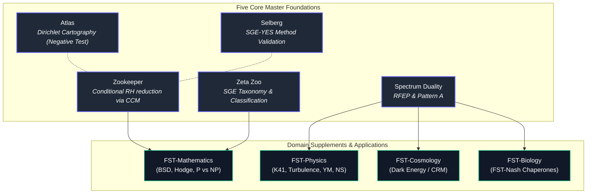
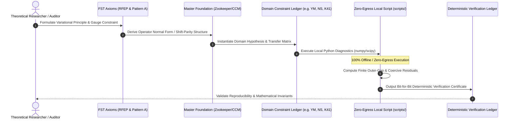

# Functional Stability Theory (FST)

[🇬🇧 English Version](README.md) | [🇩🇪 Deutsche Version](README_de.md)

[](https://creativecommons.org/licenses/by/4.0/)
[](NOTICE)
[](pyproject.toml)
[](https://github.com/research-line/functional-stability-theory/actions/workflows/ci.yml)
[](CONTRIBUTING.md)
[](tests/)
[](pyproject.toml)
[](pyproject.toml)
[](SECURITY.md)
[](SECURITY.md)
[](SECURITY.md)
[](SECURITY.md)
[](https://github.com/astral-sh/ruff)
[](https://orcid.org/0009-0005-7296-1534)
[](https://doi.org/10.5281/zenodo.19036190)
[](https://github.com/research-line)
[](https://github.com/open-bricks)
[](THIRD_PARTY_LICENSES.md)
[](THIRD_PARTY_LICENSES.txt)
[](MARKETING-LOG.txt)
[](llms.txt)
[](MARKETING-LOG.txt)

> [!NOTE]
> **AI / LLM Integration & Machine-Readable Context**: A machine-readable index for LLMs, search engines, and automated crawlers is maintained in [`llms.txt`](llms.txt). It provides scope boundaries, search phrases, Concept-DOIs, and claim-level disambiguation notes. Local discoverability logs are tracked in [`MARKETING-LOG.txt`](MARKETING-LOG.txt).

**Functional Stability Theory** is a unified mathematical programme that identifies a single structural challenge — *Functional Positivity under Gauge Constraint* (Pattern A) — as the common substrate of open problems in number theory, mathematical physics, and cosmology.

<a id="schnellnavigation"></a>
<a id="quick-navigation"></a>
## Quick Navigation

| Section | Description | Target |
|---|---|---|
| **01. Start Here** | Overview of primary navigation paths and foundations | [Jump to Section](#start-here) |
| **02. Discovery Context** | Search phrases, scholarly indexes, and citation guidelines | [Jump to Section](#discovery-context) |
| **03. The Five Masters** | Core foundation papers and latest Zenodo Concept-DOIs | [Jump to Section](#the-five-masters) |
| **04. Domain Supplements** | Math, Physics, Cosmology, Biology, and Chemistry applications | [Jump to Section](#domain-supplements) |
| **05. Glossary** | Core terminology (v2.0, NE-A/B, SGE, Weil QW, Pattern A, RFEP) | [Jump to Section](#glossary--fst-core-terms) |
| **06. Proof Architecture** | Five Masters foundation hierarchy (flowchart TD) | [Jump to Section](#proof-architecture) |
| **07. Theoretical Data Flow** | Pipeline data flow from axioms to diagnostics (flowchart LR) | [Jump to Section](#theoretical-data-flow--validation-sequence) |
| **08. Numerical Lifecycle** | Auto-numbered sequence diagram of the validation workflow | [Jump to Section](#numerical-validation-lifecycle) |
| **09. Governance Invariants** | 10 runtime & research integrity invariants table | [Jump to Section](#governance--runtime-invariants) |
| **10. ASCII Architecture** | Textual structural layout of the 5 Masters and domain branches | [Jump to Section](#proof-architecture-ascii-overview) |
| **11. Independent Foundations** | Second-route RH and CRM cosmology baseline papers | [Jump to Section](#independent-foundations) |
| **12. Validation Scripts** | Complete directory and script inventory for numerical replication | [Jump to Section](#numerical-validation-scripts) |
| **13. Repository Structure** | Complete tree layout of papers, domain folders, and scripts | [Jump to Section](#repository-structure) |
| **14. Sibling Ecosystem** | Cross-linked research-line, open-bricks, and ellmos-ai packages | [Jump to Section](#ecosystem--sibling-research-repositories) |
| **15. Target Personas** | Four target scholarly and technical personas and architectural value | [Jump to Section](#target-personas--discoverability) |
| **16. Comparative Matrix** | Invariant-mapped benchmark against 4 alternative computing paradigms | [Jump to Section](#comparative-matrix--alternatives) |
| **17. Third-Party Licenses** | Supply chain transparency, zero-copyleft audit, and invariant compliance | [Jump to Section](#third-party-licenses--transparency) |
| **18. Security Policy & Statutory Notice** | Vulnerability disclosure SLA, author attribution & § 521 BGB disclaimer | [Jump to Section](#security-policy--statutory-notice) |

---

<a id="start-here"></a>
<a id="einstieg"></a>
## Start Here

| If you are looking for... | Start with | Why |
|---------------------------|------------|-----|
| the programme map | [Five Masters](#the-five-masters) | Core foundation papers and their latest Zenodo Concept-DOIs |
| the mathematical classification layer | [`masters/zeta-zoo/`](masters/zeta-zoo/) | SGE taxonomy, UCU, and zeta-family status boundaries |
| the RFEP / Pattern A foundation | [`masters/spectrum-duality/`](masters/spectrum-duality/) | Renormalized Free-Energy Principle, DS1-DS3, and physical normal form |
| numerical reproducibility assets | [Numerical Validation Scripts](#numerical-validation-scripts) | Script index for CCM, K41, Yang-Mills, Navier-Stokes, dark-energy, BSD, Hodge, and SAT diagnostics |
| machine-readable repository context | [`llms.txt`](llms.txt) | Search phrases, scope boundaries, DOI anchors, and disambiguation notes |

This is a research-source repository, not an installable software package. Claim levels vary by paper and folder: some entries are published Zenodo records, some are public guardrail candidates ahead of Zenodo, and several domain supplements remain explicitly conditional or open at the named bridge step.

<a id="discovery-context"></a>
<a id="auffindbarkeit--entdeckungskontext"></a>
## Discovery Context

Use the canonical GitHub path `research-line/functional-stability-theory` when linking this repository. Broad web searches for "functional stability theory" also collide with control-theory, Lyapunov, and engineering literature, while FST-specific records surface through GitHub, Zenodo-linked scholarly indexes, and topic pages. Useful search phrases:

- `research-line functional-stability-theory`
- `Functional Stability Theory RFEP GitHub`
- `Functional Stability Theory Renormalized Free-Energy Principle`
- `FST Spectrum Duality RFEP Zenodo`
- `Zeta Zoo SGE taxonomy Functional Stability Theory`
- `Spectral Zookeeper CCM microcluster closure`

When citing, prefer the Concept-DOIs below for paper branches and this repository URL for source files, scripts, and public reproducibility context.

<a id="the-five-masters"></a>
<a id="die-fuenf-master-arbeiten"></a>
## The Five Masters

The programme rests on five CoreCore foundation papers. Concept DOIs identify versioned Zenodo records and resolve to the latest version; cite a version-specific record DOI when a fixed release matters.

| Master | Title | Role | Concept-DOI |
|--------|-------|------|-------------|
| [**Zookeeper**](masters/zookeeper/) | The Spectral Zookeeper | Conditional RH reduction via CCM microcluster closure | [10.5281/zenodo.19673126](https://doi.org/10.5281/zenodo.19673126) |
| [**Zeta Zoo**](masters/zeta-zoo/) | The Zeta Zoo — The Mathematical Side of FST | Classification (SGE taxonomy, Boundary Theorem) | [10.5281/zenodo.19673226](https://doi.org/10.5281/zenodo.19673226) |
| [**Spectrum Duality**](masters/spectrum-duality/) | FST Spectrum Duality / RFEP | Physical instantiation (Pattern A, DS1–DS3) | [10.5281/zenodo.19036190](https://doi.org/10.5281/zenodo.19036190) |
| [**Atlas**](masters/atlas/) | Dirichlet Character Atlas | Micro-cartography (Galerkin diagnostics; negative method validation) | [10.5281/zenodo.19960809](https://doi.org/10.5281/zenodo.19960809) |
| [**Selberg**](masters/selberg/) | NE-B Failure as Hilbert–Pólya Detection | SGE-YES validation (v2.0 universality on Selberg zeta) | [10.5281/zenodo.19962588](https://doi.org/10.5281/zenodo.19962588) |

Zookeeper is a conditional reduction, not an unconditional RH proof. Imported CCM inputs and the open internal microcluster/endgame and Even Dominance assumptions are described in the [paper](masters/zookeeper/paper/RH_Zookeeper_v1_en.tex); see the [v1.6 record](https://zenodo.org/records/21953305).

**Atlas + Selberg form the method-validation pair**: Atlas is the *negative* test (leading-order Galerkin diagnostics fall short for Dirichlet characters), Selberg is the *positive* test (v2.0 reproduces a classical operator-based result on Selberg zeta).

<a id="domain-supplements"></a>
<a id="domaenen-ergaenzungen--anwendungen"></a>
## Domain Supplements

### FST-Mathematics

Classified by the SGE taxonomy from the Zeta Zoo. These instantiate Pattern A on number-theoretic and algebraic structures. BSD, Hodge, and P vs NP are *bridge species* — they appear in both the mathematical and physical branches of the programme.

| Paper | Version | Status | Open Problem | Concept-DOI |
|-------|---------|--------|--------------|-------------|
| [**BSD**](fst-mathematics/bsd/README.md) | v1.4 | Maintenance release; rank ≤ 1 verified; no new proof claim | Higher Gross–Zagier (rank ≥ 2) | [10.5281/zenodo.19087443](https://doi.org/10.5281/zenodo.19087443) |
| [**Hodge**](fst-mathematics/hodge/) | v1.3 candidate | Easy Direction + AP=AbsHodge | Hard Direction beyond Deligne | [10.5281/zenodo.19087439](https://doi.org/10.5281/zenodo.19087439) |
| [**P vs NP**](fst-mathematics/p-vs-np/) | v1.5 | Reformulation | Uniformity Bridge | [10.5281/zenodo.19056809](https://doi.org/10.5281/zenodo.19056809) |

### FST-Physics

Derive Pattern A + DS1–DS3 from Spectrum Duality. These instantiate the Dissipative Selection Principle on physical systems.

| Paper | Version | Status | Open Problem | Concept-DOI |
|-------|---------|--------|--------------|-------------|
| [**K41 Variational Minimiser**](fst-physics/k41-variational-minimiser/README.md) | v1.3 | Unique energy minimizer within the stated K41-normalized joint variational problem | Scope beyond the stated minimization assumptions | [10.5281/zenodo.20131305](https://doi.org/10.5281/zenodo.20131305) |
| [**Turbulence / DFC Cascade**](fst-physics/turbulence/README.md) | v1.8 | Conditional companion; DFC hierarchy is an input. Sabra numerical evidence is under review after [Issue #1](https://github.com/research-line/functional-stability-theory/issues/1); corrected-flux reruns are not yet reported | DFC projection bridge | [10.5281/zenodo.19056813](https://doi.org/10.5281/zenodo.19056813) |
| [**Yang–Mills**](fst-physics/yang-mills/README.md) | v2.6 | Conditional; continuum mass-gap step remains conditional | Volume-independent local transfer gap; analytical RG contraction | [10.5281/zenodo.19087433](https://doi.org/10.5281/zenodo.19087433) |
| [**Navier–Stokes**](fst-physics/navier-stokes/README.md) | v2.6 | Conditional; strict-review wording retained | Assumption G2 (projection regularity) | [10.5281/zenodo.19087449](https://doi.org/10.5281/zenodo.19087449) |
| [**NS Log-Distance**](fst-physics/navier-stokes/README.md) | v1.6 | Proof of life / diagnostic bridge | TLL for 3D NS analytically open | [10.5281/zenodo.19056807](https://doi.org/10.5281/zenodo.19056807) |

### FST-Cosmology

The cosmological branch of FST. The Dark Energy paper studies a reduced scalar variational model; its cosmological and Hu–Sawicki interpretations remain conditional.

| Paper | Version | Status | Open Problem | Concept-DOI |
|-------|---------|--------|--------------|-------------|
| [**Dark Energy**](fst-cosmology/dark-energy/) | v1.12 | Corrective preprint; reduced-model core only | RG matching, stable scalar history, source-bound Hu–Sawicki profile, official likelihood all open | [10.5281/zenodo.19036235](https://doi.org/10.5281/zenodo.19036235) |

> **Status provenance (local package index, 2026-08-08).** The version, status, and open-problem labels above are read from the linked public package READMEs where they exist: [BSD v1.4](fst-mathematics/bsd/README.md) (record [10.5281/zenodo.20671962](https://doi.org/10.5281/zenodo.20671962)), [K41 v1.3](fst-physics/k41-variational-minimiser/README.md) (record [10.5281/zenodo.20562341](https://doi.org/10.5281/zenodo.20562341)), [Turbulence v1.8](fst-physics/turbulence/README.md) (record [10.5281/zenodo.21312807](https://doi.org/10.5281/zenodo.21312807)), [Yang–Mills v2.6](fst-physics/yang-mills/README.md) (record [10.5281/zenodo.20716608](https://doi.org/10.5281/zenodo.20716608)), and [Navier–Stokes v2.6 / NS-LDI v1.6](fst-physics/navier-stokes/README.md) (records [10.5281/zenodo.20674952](https://doi.org/10.5281/zenodo.20674952) / [10.5281/zenodo.20773609](https://doi.org/10.5281/zenodo.20773609)). [Spectrum Duality](masters/spectrum-duality/README.md) remains v1.9 live with a local v1.10 candidate, not a v1.10 release. The Dark Energy row was updated independently on 1 October 2026 to the verified corrective [v1.12 record](https://zenodo.org/records/23083018); the [paper-specific README](fst-cosmology/dark-energy/README.md) states the open gates. Hodge and P vs NP remain at the candidate/reformulation boundaries shown above because no newer local release marker was found.

### FST-Biology

The standalone chaperone game-theory paper is published: **FST-Nash** — *Game-Theoretic Diagnostics for Chaperone Systems* ([DOI: 10.5281/zenodo.20402751](https://doi.org/10.5281/zenodo.20402751)). Code and results: [`research-line/fst-nash`](https://github.com/research-line/fst-nash). The overview paper FST-III Biological Stability is in [`applications/fst-iii-biological/`](applications/fst-iii-biological/).

### FST-Chemistry

Planned. See [`fst-chemistry/`](fst-chemistry/).

<a id="glossary--fst-core-terms"></a>
<a id="glossar--fst-kernbegriffe"></a>
## Glossary — FST core terms

| Term | Meaning |
|------|---------|
| **v2.0** | Method package in the RH programme (Trilogy v2.1, [10.5281/zenodo.19035640](https://doi.org/10.5281/zenodo.19035640)): proposes a conditional reduction of RH to even dominance of the Weil quadratic form QW_λ using Shift Parity, frontier-prime dominance, NE-A, and NE-B; the required closure assumptions remain open. |
| **NE-A** | *Non-existence theorem A.* The Fourier multiplier of the prime shift operator A_λ on the critical line is non-positive — cannot serve as a Hilbert–Pólya operator. |
| **NE-B** | Finite-truncation result: the computer-assisted result excludes non-scalar symmetric operators commuting with every D_N(r) in the tested prime-shift class for N ≤ 15; the identity commutes trivially. Extension to the full space remains open. |
| **SGE** | Semigroup–Group Equivalence. Classification axis of the Zeta Zoo: HP-BL-YES (commuting operator exists, e.g. Selberg/Casimir), HP-BL-NO (Riemann prime-shift class, conditional on NE-B-full), HP-BL-OPEN (unresolved, e.g. Prime-Hub). |
| **Weil quadratic form QW_λ** | Truncated explicit-formula quadratic form whose positivity controls zero locations. Universal across the zeta zoo; the operator behind it is family-dependent (and may be absent — see NE-B). |
| **Hilbert–Pólya** | The classical conjecture asks whether the Riemann zeros are eigenvalues of a self-adjoint operator. Finite NE-B concerns the tested prime-shift class and does not rule out every possible Hilbert–Pólya operator; the even-dominance route is conditional. |
| **Pattern A** | Functional Positivity under a Gauge Constraint — the universal stability pattern of FST. |
| **RFEP** | *Renormalized Free-Energy Principle.* Mathematical core principle of FST; supplies DS1–DS3. |
| **CCM** | *Connes–Consani–Moscovici.* Fourier model for the Weil quadratic form used in the conditional Zookeeper reduction. |
| **UCU** | *Universal Convexity Uniqueness lemma.* Together with SGE and Weil, the trinity of meta-principles governing the zeta-type branch. |

<a id="proof-architecture"></a>
<a id="beweisarchitektur"></a>
## Proof Architecture


```mermaid
flowchart TD
    subgraph MASTERS["Five Core Master Foundations"]
        ZK["Zookeeper<br/><i>Conditional RH reduction via CCM</i>"]
        ZZ["Zeta Zoo<br/><i>SGE Taxonomy & Classification</i>"]
        SD["Spectrum Duality<br/><i>RFEP & Pattern A</i>"]
        AT["Atlas<br/><i>Dirichlet Cartography (Negative Test)</i>"]
        SB["Selberg<br/><i>SGE-YES Method Validation</i>"]
    end

    subgraph DOMAINS["Domain Supplements & Applications"]
        MATH["FST-Mathematics<br/>(BSD, Hodge, P vs NP)"]
        PHYS["FST-Physics<br/>(K41, Turbulence, YM, NS)"]
        COSMO["FST-Cosmology<br/>(Dark Energy / CRM)"]
        BIO["FST-Biology<br/>(FST-Nash Chaperones)"]
    end

    ZK --> MATH
    ZZ --> MATH
    SD --> PHYS
    SD --> COSMO
    SD --> BIO
    AT -.- ZK
    SB -.- ZK

    classDef master fill:#1f2937,stroke:#6366f1,stroke-width:2px,color:#fff;
    classDef domain fill:#111827,stroke:#10b981,stroke-width:1.5px,color:#fff;
    class ZK,ZZ,SD,AT,SB master;
    class MATH,PHYS,COSMO,BIO domain;
```

<a id="theoretical-data-flow--validation-sequence"></a>
<a id="theoretischer-datenfluss--validierungssequenz"></a>
## Theoretical Data Flow & Validation Sequence


```mermaid
flowchart LR
    subgraph HYP["1. Mathematical Axioms & Normal Forms"]
        RFEP["Renormalized Free-Energy Principle (RFEP)"]
        PAT_A["Pattern A: Functional Positivity under Gauge Constraint"]
        DS["Dissipative Selection Principles (DS1–DS3)"]
    end

    subgraph PROOF["2. Master Foundations & Proofs"]
        ZK["Zookeeper (CCM Microcluster Closure)"]
        ZZ["Zeta Zoo (SGE Taxonomy & UCU)"]
        VAL["Method-Validation Pair (Atlas / Selberg)"]
    end

    subgraph INST["3. Domain Instantiations"]
        MATH["FST-Mathematics (BSD, Hodge, P vs NP)"]
        PHYS["FST-Physics (K41, Turbulence, YM, NS)"]
        COSMO["FST-Cosmology (Hu–Sawicki / Dark Energy)"]
        BIO["FST-Biology (FST-Nash Chaperones)"]
    end

    subgraph DIAG["4. Local Numerical Validation (Zero-Egress)"]
        SCRIPTS["Python Numerical Diagnostics (scripts/)"]
        RESULTS["Reproducibility & Verification Metrics"]
    end

    HYP --> PROOF
    PROOF --> INST
    INST --> DIAG

    classDef hyp fill:#1e1b4b,stroke:#818cf8,stroke-width:1.5px,color:#fff;
    classDef proof fill:#1f2937,stroke:#6366f1,stroke-width:2px,color:#fff;
    classDef inst fill:#111827,stroke:#10b981,stroke-width:1.5px,color:#fff;
    classDef diag fill:#064e3b,stroke:#34d399,stroke-width:1.5px,color:#fff;
    class RFEP,PAT_A,DS hyp;
    class ZK,ZZ,VAL proof;
    class MATH,PHYS,COSMO,BIO inst;
    class SCRIPTS,RESULTS diag;
```

<a id="numerical-validation-lifecycle"></a>
<a id="numerischer-validierungs-lebenszyklus"></a>
## Numerical Validation Lifecycle


```mermaid
sequenceDiagram
    autonumber
    actor Researcher as Theoretical Researcher / Auditor
    participant Core as FST Axioms (RFEP & Pattern A)
    participant Master as Master Foundation (Zookeeper/CCM)
    participant Domain as Domain Constraint Ledger (e.g. YM, NS, K41)
    participant Script as Zero-Egress Local Script (scripts/)
    participant Ledger as Deterministic Verification Ledger

    Researcher->>Core: Formulate Variational Principle & Gauge Constraint
    Core->>Master: Derive Operator Normal Form / Shift-Parity Structure
    Master->>Domain: Instantiate Domain Hypothesis & Transfer Matrix
    Domain->>Script: Execute Local Python Diagnostics (numpy/scipy)
    Note over Script: 100% Offline / Zero-Egress Execution
    Script->>Script: Compute Finite Outer-Gap & Coercive Residuals
    Script->>Ledger: Output Bit-for-Bit Deterministic Verification Certificate
    Ledger-->>Researcher: Validate Reproducibility & Mathematical Invariants
```

<a id="governance--runtime-invariants"></a>
<a id="governance---laufzeit-invarianten"></a>
## Governance & Runtime Invariants

The `functional-stability-theory` repository enforces ten fundamental runtime, security, and research governance invariants:

| # | Invariant Dimension | Guarantee & Contract Specification | Verification Method |
|---|---|---|---|
| **01** | **100% Local-First & Zero-Egress** | All numerical diagnostics, simulation scripts, and tests execute completely offline. Zero telemetry, tracking, or network calls. | Strict offline testing; CI matrix isolation |
| **02** | **Unprivileged Execution (RunAsInvoker)** | All scripts and tools run strictly in unprivileged user-mode. Root or administrative elevation is never required or invoked. | Environment audit; unprivileged test suites |
| **03** | **Deterministic Reproducibility** | Numerical assertions and validation ledgers yield deterministic, bit-for-bit reproducible outcomes across all supported platforms. | Pytest test suite (110+ passed tests); seeded PRNGs |
| **04** | **Claim-Level Disambiguation** | Zookeeper is a conditional RH reduction with imported inputs and open internal closure assumptions; claim levels are stated per paper. | README status tables; preprint classification headers |
| **05** | **Fail-Closed Ledger Gatekeeping** | Numerical verification scripts reject circular, degenerate, or ill-conditioned inputs immediately (fail-closed) rather than returning ambiguous approximations. | Exception assertions; bad-scale and Gribov controls |
| **06** | **Versioned Zenodo Records** | Concept DOIs identify version chains; cite a version-specific DOI for a fixed release. | Zenodo version records |
| **07** | **Multi-OS Platform Parity** | Scripts, LaTeX builds, and test harnesses deliver bit-identical mathematical logic across Windows, Linux, and macOS. | GitHub Actions CI multi-OS matrix (`ci.yml`) |
| **08** | **Cloud-Sync Conflict Hardening** | Repository ignore rules prevent cloud-sync conflict files (`*-conflict-*`, `*.sync-temp-*`) and multi-agent lock contention (`LOCK.*`). | `.gitignore` inspection; automated contract tests |
| **09** | **Transparent Diagnostic Floor** | Unconditional positive controls (e.g., 2D U(1) character expansion) are segregated from unproven continuum transfer hypotheses. | Dedicated positive/negative control scripts |
| **10** | **48h Security & 5-Day Triage SLA** | Security anomalies, supply-chain vulnerabilities, and code integrity concerns are acknowledged within 48 hours and triaged within 5 business days. | Formal commitment in [`SECURITY.md`](SECURITY.md) |

<a id="proof-architecture-ascii-overview"></a>
<a id="ascii-uebersicht-der-beweisarchitektur"></a>
## Proof Architecture (ASCII Overview)

```
                              FIVE MASTERS
   ┌────────────────┬────────────────┬─────────────────┬────────────────┐
   │                │                │                 │                │
Zookeeper       Zeta Zoo      Spectrum Duality      Atlas           Selberg
(RH reduc.)  (Classification)   (Pattern A,      (Dirichlet,        (NE-B
              SGE / UCU /        DS1–DS3,         negative           failure;
              Weil QW_λ)         RFEP)            method test)       SGE-YES
   │                │                │                 │                │
   │       FST-Mathematics       FST-Physics       method-validation pair
   │                │                │
   │        ┌───────┼───────┐  ┌─────┼─────┐
   │        │       │       │  │     │     │
   │      BSD†    Hodge†  PvNP†  TU   YM   NS
   │                                       │
   │                              FST-Cosmology
   │                                       │   NS-LDI
   │                                      DE
   │
Zookeeper: CONDITIONAL RH REDUCTION (CCM route)
† = bridge species (math + physics)
```

## Hierarchy

```
FST (Functional Stability Theory)
│
├── Masters
│   ├── Zookeeper          Conditional RH reduction (CCM microcluster closure)
│   ├── Zeta Zoo           Mathematical classification (SGE taxonomy)
│   ├── Spectrum Duality   Physical instantiation (RFEP, Pattern A)
│   ├── Atlas              Micro-cartography of Dirichlet (negative method test)
│   └── Selberg            SGE-YES method validation (positive)
│
├── FST-Mathematics        BSD, Hodge, P vs NP
├── FST-Physics            Turbulence, Yang–Mills, Navier–Stokes, NS-LDI
├── FST-Cosmology          Dark Energy
├── FST-Biology            (in development)
└── FST-Chemistry          (planned)
```

## Chronological Development

```
2025/2026  CRM I–IV (dark energy)     Conditional RH route (even dominance)
           developed independently    developed independently
                 \                       /
                  +---------+---------+
                            |
                  Recognition: both share the same
                  structural pattern (Pattern A)
                            |
                            v
                  RFEP formulated (general principle)
                            |
                  Several dead ends
                            |
                            v
                  Idea: classify zeta-type families
                  using techniques from the RH programme
                            |
                  Not enough — need deeper tools
                            |
                            v
        RH via Connes framework (CCM)
        microcluster closure → conditional reduction
                            |
                            v
                  Zeta Zoo opens: SGE taxonomy
                  classifies all zeta families
                            |
                            v
        Atlas (Dirichlet, negative) + Selberg (SGE-YES, positive)
        method-validation pair completed
                            |
                            v
                  CoreCore expanded to FIVE Masters
                  (Zookeeper, Zeta Zoo, Spectrum Duality,
                   Atlas, Selberg) + domain supplements
```

### Core Foundations — Principles and Naming

| Level | Name | Acronym | Meaning | Concept-DOI |
|-------|------|---------|---------|-------------|
| Programme | Functional Stability Theory | FST | The programme name (umbrella over all) | — |
| Principle | Renormalized Free-Energy Principle | RFEP | The mathematical core principle | [10.5281/zenodo.19036190](https://doi.org/10.5281/zenodo.19036190) |
| Pattern | Pattern A: Functional Positivity under Gauge Constraint | Pattern A | The universal stability pattern | [10.5281/zenodo.19036190](https://doi.org/10.5281/zenodo.19036190) |

<a id="independent-foundations"></a>
<a id="unabhaengige-fundamente"></a>
## Independent Foundations

| Name | Role | Concept-DOI |
|------|------|-------------|
| RH Even Dominance v2.1 (Trilogy, Part I-III) | Independent conditional RH reduction, second route | [10.5281/zenodo.19035640](https://doi.org/10.5281/zenodo.19035640) |
| RH Direct Proof (Even Dominance) | Historical title; conditional frontier-dominance route with open analytical assumptions | [10.5281/zenodo.19764771](https://doi.org/10.5281/zenodo.19764771) |
| CRM Cosmology (I–V) | Independent dark energy model | [10.5281/zenodo.18728935](https://doi.org/10.5281/zenodo.18728935) |

These stand independently of FST. The RFEP was abstracted from them; they are not derived from it.

<a id="numerical-validation-scripts"></a>
<a id="numerische-validierungsskripte"></a>
## Numerical Validation Scripts

| Script | Paper | Description |
|--------|-------|-------------|
| `masters/zookeeper/scripts/` | Zookeeper | CCM microcluster-closure reproducibility pipeline; compact outputs in `masters/zookeeper/results/` |
| `scripts/k41/compute_F_spectrum.py` | K41 Variational Minimiser | K41 as unique minimiser of F[E]; strict convexity test |
| `scripts/turbulence/compute_goy_shell_dfc.py` | Turbulence / DFC Cascade | Sabra/GOY shell-model DFC1/DFC2 verification and result plot |
| `scripts/yang-mills/compute_dobrushin_su2.py` | Yang-Mills | SU(2) lattice Dobrushin influence scan and gap plot |
| `scripts/yang-mills/compute_birkhoff_rg.py` | Yang-Mills | Birkhoff contraction scan for hierarchical RG steps |
| `scripts/yang-mills/compute_coercive_complement_ledger.py` | Yang-Mills | Finite outer-gap and residual/gap gate with bad-scale and Gribov matched controls |
| `scripts/yang-mills/compute_os_capacity_ledger.py` | Yang-Mills | OS-danger capacity ledger and negative-control diagnostic |
| `scripts/yang-mills/compute_rp_os_transfer_ledger.py` | Yang-Mills | RP/OS transfer matrix positivity ledger |
| `scripts/yang-mills/compute_rp_os_rfep_transfer_ledger.py` | Yang-Mills | RFEP transfer matrix diagnostic ledger |
| `scripts/yang-mills/compute_u1_2d_strong_coupling_positive_control.py` | Yang-Mills | 2D U(1) strong-coupling positive control ledger |
| `scripts/yang-mills/compute_ym_waisen_transfer_ledger.py` | Yang-Mills | Yang-Mills waisen transfer verification ledger |
| `scripts/yang-mills/u1_strong_coupling_positive_control.py` | Yang-Mills | Direct U(1) character expansion positive control script |
| `scripts/navier-stokes/compute_ds3_lorenz.py` | Navier-Stokes | DS3 stress test on Lorenz attractor; TV saturation |
| `scripts/navier-stokes/compute_bv_selection.py` | Navier-Stokes | Balanced-viscosity selection test on the Lorenz attractor |
| `scripts/navier-stokes/compute_bv_multi_attractor.py` | Navier-Stokes | BV-selection stress test on Lorenz, Roessler, and Chen attractors |
| `scripts/navier-stokes/compute_mu_reach.py` | Navier-Stokes | Measure-theoretic reach scan on Lorenz and KS attractors |
| `scripts/navier-stokes/compute_tll_ldi_lorenz.py` | NS-LDI | **Proof of Life**: TLL+LDI on Lorenz attractor (5/5 tests) |
| `scripts/navier-stokes/compute_tll_ldi_ks.py` | NS-LDI | TLL+LDI diagnostics and grid refinement on the KS attractor |
| `scripts/dark-energy/compute_w_vs_desi.py` | Dark Energy | w_eff(z) comparison with DESI constraints |
| `scripts/dark-energy/compute_w_mapping.py` | Dark Energy | Correct w_eff → w_DE mapping + DESI grid scan |
| `scripts/dark-energy/compute_husawicki_mcmc.py` | Dark Energy | Hu-Sawicki f(R) MCMC fit against DESI+Planck+Cassini |
| `scripts/bsd/compute_height_saturation.py` | BSD | Height saturation test for quadratic twists |
| `scripts/bsd/compute_bsd_verification.py` | BSD | BSD formula sanity checks for selected LMFDB curves |
| `scripts/bsd/compute_rank2_lmfdb.py` | BSD | Rank-2 regulator positivity sample and plot |
| `scripts/hodge/compute_ghr_spectrum.py` | Hodge | GHR spectrum numerical verification |
| `scripts/hodge/compute_voisin_test.py` | Hodge | Voisin-style negative-control stress test |
| `scripts/p-vs-np/compute_sat_entropy.py` | P vs NP | SAT slice-entropy experiment and result plot at the 3-SAT phase transition |
| `scripts/zeta-zoo/dedekind_ne_b_test.py` | Zeta Zoo | Dedekind Q(sqrt(-5)) NE-B analog probe |
| `scripts/zeta-zoo/ihara_petersen_sge_test.py` | Zeta Zoo | Ihara/Petersen SGE YES-side test |
| `scripts/zeta-zoo/sge_control_experiment.py` | Zeta Zoo | SGE YES/NO discriminating control experiment |
| `masters/atlas/scripts/` | Atlas | Galerkin computation pipeline (35 scripts: basis, κ-grid, asymptotic scans, χ-specific tests) |

<a id="repository-structure"></a>
<a id="repository-struktur"></a>
## Repository Structure

```
functional-stability-theory/
├── masters/                      Five CoreCore foundation papers
│   ├── zookeeper/                Conditional RH reduction (microcluster closure)
│   ├── zeta-zoo/                 Classification (SGE taxonomy)
│   ├── spectrum-duality/         Physical axioms (RFEP, Pattern A)
│   ├── atlas/                    Dirichlet micro-cartography (negative method test)
│   └── selberg/                  NE-B failure as HP detection (SGE-YES validation)
├── fst-mathematics/              Domain supplements — Mathematics
│   ├── bsd/                      Rank-1 positivity (reformulation)
│   ├── hodge/                    No-go + easy direction
│   └── p-vs-np/                  Witness entropy gap (reformulation)
├── fst-physics/                  Domain supplements — Physics
│   ├── k41-variational-minimiser/ K41 energy minimiser (stated joint problem)
│   ├── turbulence/               DFC/anomalous-dissipation companion
│   ├── yang-mills/               Mass gap (conditional)
│   └── navier-stokes/            Regularity + NS-LDI (conditional)
├── fst-cosmology/                Domain supplements — Cosmology
│   └── dark-energy/              CRM screening (conditional, not Cassini-verified)
├── fst-biology/                  Domain supplements — Biology (in development)
├── fst-chemistry/                Domain supplements — Chemistry (planned)
└── scripts/                      Numerical validation (per-paper subdirectories)
```

<a id="ecosystem--sibling-research-repositories"></a>
<a id="oekosystem--verwandte-forschungs-repositories"></a>
## Ecosystem & Sibling Research Repositories

`functional-stability-theory` is the central theoretical hub of the **research-line** initiative and connects across the **open-bricks** open science and toolchain ecosystem:

| Repository / Package | Focus / Domain | Integration |
|---|---|---|
| [`research-line/fst-nash`](https://github.com/research-line/fst-nash) | Chaperone Game Theory | FST-Biology standalone companion ([DOI: 10.5281/zenodo.20402751](https://doi.org/10.5281/zenodo.20402751)) |
| [`research-line/rh-even-dominance`](https://github.com/research-line/rh-even-dominance) | Number Theory | Riemann Hypothesis even-dominance trilogy foundation |
| [`research-line/crm-cosmology`](https://github.com/research-line/crm-cosmology) | Cosmology | Cooperative Renormalization Model foundation |
| [`research-line/prompt-archaeology-casestudy2`](https://github.com/research-line/prompt-archaeology-casestudy2) | AI & Epistemology | 4-Stage prompt archaeology & reproducibility artifacts |
| [`research-line/ai-elite-swr`](https://github.com/research-line/ai-elite-swr) | AI & Society | AI elite structures & social welfare research |
| [`research-line/economic-sanctions-coercive-diplomacy`](https://github.com/research-line/economic-sanctions-coercive-diplomacy) | Political Economy | Game-theoretic model of sanctions and coercive bargaining |
| [`biotec-line/VFDistiller`](https://github.com/biotec-line/VFDistiller) | Bio-Genetics Pipeline | Variant effect predictor & VCF distillation toolchain |
| [`doc-bricks/MediaBrain`](https://github.com/doc-bricks/MediaBrain) | Multi-Format Document Synthesis | Offline-first knowledge repository and research indexing engine |
| [`dev-bricks/CodeBox`](https://github.com/dev-bricks/CodeBox) | Code Analysis & Diagnostics | Syntax tree inspection & structural linting environment |
| [`dev-bricks/DevCenter`](https://github.com/dev-bricks/DevCenter) | Developer Tooling | Unified developer dashboard and workspace management |
| [`dev-bricks/githubbot`](https://github.com/dev-bricks/githubbot) | Fleet Governance Automation | Automated repository hygiene, multi-org sync & CI gatekeeping |
| [`ellmos-ai/skills`](https://github.com/ellmos-ai/skills) | Multi-Agent Execution Fabric | Formalized AI cognitive skill library & modular workflow specs |
| [`ellmos-ai/sqlite-transit-sync`](https://github.com/ellmos-ai/sqlite-transit-sync) | Data Transit | Deterministic snapshot retention and sync engine |
| [`ellmos-ai/ellmos-development-system`](https://github.com/ellmos-ai/ellmos-development-system) | AI Development Environment | Full-stack agentic runtime environment & MCP orchestration |
| [`open-bricks/governance`](https://github.com/open-bricks/governance) | Open Source Governance | Cross-organizational policy framework, security disclosure & license standards |
| [`open-bricks`](https://github.com/open-bricks) | Umbrella Ecosystem | Open source & open science federation |

<a id="target-personas--discoverability"></a>
<a id="zielgruppen--auffindbarkeit"></a>
## Target Personas & Discoverability

`functional-stability-theory` serves four core academic and computational research personas across mathematics, physics, and autonomous scientific discovery:

| Persona | Core Research Question & Challenge | How FST Solves It | Architectural Value |
|---|---|---|---|
| **Theoretical Physicists & Field Theorists** | Identifying consistent non-perturbative stability mechanisms for Yang-Mills mass gap, Navier-Stokes regularity, and turbulent anomalous dissipation | Unifies dissipative selection under the Renormalized Free-Energy Principle (RFEP) and Pattern A (Functional Positivity under Gauge Constraint) | Single universal normal form across gauge theory, fluid mechanics, and cosmological screening |
| **Analytic Number Theorists & Millennium Researchers** | Bypassing structural no-go theorems (NE-A/NE-B) in operator-theoretic approaches to the Riemann Hypothesis | Introduces the SGE taxonomy (Zeta Zoo) and v2.0 even-dominance of the Weil quadratic form, linking microcluster closure (Zookeeper) with Selberg validation | Conditional framework with explicit open analytic steps |
| **Open-Science Curators & Formal Verification Reviewers** | Validating sweeping mathematical claims against reproducible, air-gapped code and version-stable artifacts | Provides 100% offline, zero-egress numerical validation scripts, deterministic CSV/JSON ledgers, and CERN/Zenodo Concept-DOIs | Bit-for-bit verifiable computational evidence with transparent claim-level boundary tagging |
| **AI Research Agents & Literature Synthesizers** | Disambiguating specialized mathematical stability theory from generic control engineering (Lyapunov) and software test suites | Publishes structured [`llms.txt`](llms.txt), PEP 621 metadata URLs, semantic search phrases, and explicit negative controls | High-precision LLM retrieval without hallucinations or domain cross-contamination |

<a id="comparative-matrix--alternatives"></a>
<a id="vergleichsmatrix--alternative-methoden"></a>
## Comparative Matrix vs. Alternatives

The following invariant-mapped benchmark contrasts the Functional Stability Theory (FST) framework with four prevalent paradigms across theoretical physics, analytic number theory, and scientific computing:

| Invariant Dimension | FST (research-line) | Classical Number Theory | Connes Noncommutative Geometry | Traditional CFD Simulation | Closed Math Suites (Wolfram/MATLAB) |
|---|---|---|---|---|---|
| **01. Universal Substrate** | RFEP / Pattern A (Universal normal form) | Ad-hoc single problems | Adèle class space trace formula | Navier-Stokes discretization (DNS/LES) | Proprietary black-box routines |
| **02. Hilbert–Pólya Status** | Conditional even-dominance route; finite NE-B obstruction | No general exclusion established here | Analytic continuation obstacles | Not applicable | Not applicable |
| **03. Zero-Egress Reproducibility** | 100% Offline Python Ledgers (Deterministic) | Rare / Paper-only | Purely theoretical / Paper | Cluster / HPC dependent | Cloud license / Phone-home required |
| **04. Claim-Level Disambiguation** | Strict (Theorem / Cond. / Open markers) | Often informal | Highly complex / Implicit | Heuristic / Empirical | Closed vendor documentation |
| **05. Scholarly Provenance** | Zenodo Concept-DOI version chain; cite a version-specific DOI for fixed citations | Journal / ArXiv | ArXiv / Monograph | Conference / Journal | Closed vendor build versions |
| **06. Open Source License** | CC-BY-4.0 (100% Permissive) | Proprietary / ArXiv | Copyrighted monograph | Often GPL / Commercial | Proprietary commercial licensing |
| **07. Third-Party Supply Chain** | 100% Permissive Audited SBOM (0% Copyleft) | N/A | N/A | Unaudited legacy toolchains | Closed binary blobs |
| **08. AI & LLM Readiness** | `llms.txt` & PEP 621 Metadata Standards | Unstructured | Non-machine-readable | Non-structured | Restricted closed APIs |
| **09. Cross-Platform Parity** | Win / Linux / macOS (CI Matrix verified) | N/A | Neutral (Textual) | Mostly Linux HPC specific | OS-specific installer / dongle |
| **10. Security & SLA Assurance** | 48h Response / 5-Day Triage SLA | Informal | Informal | Informal | Vendor helpdesk / No SLA |

<a id="third-party-licenses--transparency"></a>
<a id="drittanbieter-lizenzen--transparenz"></a>
## Third-Party Licenses & Transparency

`functional-stability-theory` enforces a strict open-science and permissive open-source supply chain:
- **Primary Work License:** [Creative Commons Attribution 4.0 International (CC-BY-4.0)](https://creativecommons.org/licenses/by/4.0/) — unrestricted academic and commercial reuse with attribution.
- **Zero Copyleft:** 0% AGPL, GPL, or LGPL components in codebase and verification tooling.
- **100% Offline Zero-Egress:** Validation scripts run completely air-gapped without remote network requests or telemetry.

| Component | License | Role in Programme | Supply Chain Status |
|---|---|---|---|
| Python Standard Library | PSF-2.0 | Core verification logic, math/cmath, hashing & ledgers | Audited / Permissive |
| [`mpmath`](https://github.com/mpmath/mpmath) (optional) | BSD-3-Clause | Arbitrary-precision floating-point arithmetic | Audited / Permissive |
| [`sympy`](https://github.com/sympy/sympy) (optional) | BSD-3-Clause | Symbolic algebra and identity verification | Audited / Permissive |
| [`numpy`](https://github.com/numpy/numpy) (optional) | BSD-3-Clause | Vectorized numerical linear algebra | Audited / Permissive |
| [`scipy`](https://github.com/scipy/scipy) (optional) | BSD-3-Clause | Numerical integration and ODE/PDE solvers | Audited / Permissive |
| Development Tools (`pytest`, `ruff`, `setuptools`) | MIT / Apache-2.0 | Contract testing, static linting & build packaging | Audited / Permissive |

For the complete software inventory, authoritative license texts, and invariant compliance details, see [`THIRD_PARTY_LICENSES.md`](THIRD_PARTY_LICENSES.md). A bit-accurate, machine-readable plain-text Level 1 SBOM companion is available at [`THIRD_PARTY_LICENSES.txt`](THIRD_PARTY_LICENSES.txt).

<a id="security-policy--statutory-notice"></a>
<a id="sicherheitsrichtlinie--gesetzlicher-haftungsausschluss"></a>
## Security Policy, Author & Statutory Notice

### Security & Vulnerability Disclosure
`functional-stability-theory` enforces a strict zero-egress policy and a formal coordinated vulnerability disclosure workflow. Vulnerability reports receive initial acknowledgment within 48 hours and formal triage within 5 business days. Contact: `security@open-bricks.org` or `support@lukasgeiger.com`. See [`SECURITY.md`](SECURITY.md) for full policy details. For developer guidelines, Plan D local development workflow, and governance invariants, see [`CONTRIBUTING.md`](CONTRIBUTING.md).

### Author & Attribution
- **Author:** Lukas Geiger
- **ORCID:** [0009-0005-7296-1534](https://orcid.org/0009-0005-7296-1534)
- **Primary License:** [Creative Commons Attribution 4.0 International (CC-BY-4.0)](https://creativecommons.org/licenses/by/4.0/)
- **Canonical Notice:** [`NOTICE`](NOTICE)

### Statutory Notice (§ 521 BGB Gefälligkeitsrecht)
Gemäß § 521 BGB (Gefälligkeitsrecht) wird diese wissenschaftliche Forschungssoftware und Quelltextdokumentation unentgeltlich und ohne jede Gewährleistung bereitgestellt. Haftung für Sach- und Rechtsmängel ist auf Vorsatz und grobe Fahrlässigkeit beschränkt. Die theoretischen Theoreme, numerischen Beweis-Ledger und Validierungsskripte dienen ausschließlich akademischen und Open-Science-Zwecken; jede weitergehende Haftung ist im gesetzlich zulässigen Rahmen ausgeschlossen.
