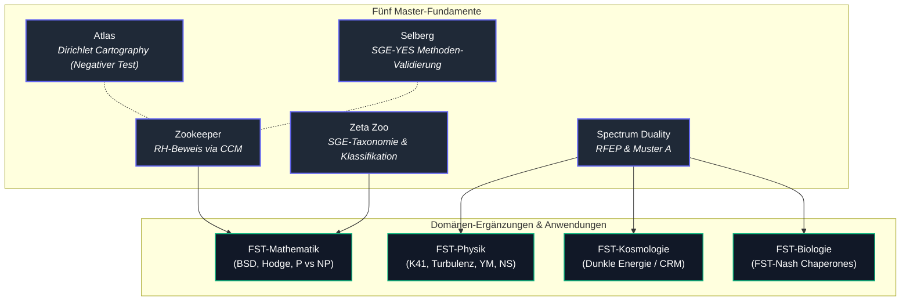

# Funktionelle Stabilitätstheorie (FST)

[English](README.md) | Deutsch

> [!NOTE]
> **KI- / LLM-Integration & Maschinenlesbarer Kontext**: Ein maschinenlesbarer Index für LLMs, Suchmaschinen und automatisierte Crawler wird in [`llms.txt`](llms.txt) gepflegt. Er enthält Gültigkeitsgrenzen, Suchbegriffe, Konzept-DOIs und Abgrenzungshinweise.

Die **Funktionelle Stabilitätstheorie (FST)** ist ein einheitliches mathematisches Forschungsprogramm, das eine zentrale strukturelle Herausforderung — *Funktionelle Positivität unter Eichbedingung* (Muster A / Pattern A) — als gemeinsamen Kern offener Probleme in Zahlentheorie, mathematischer Physik und Kosmologie identifiziert.

## Einstieg

| Wenn Sie suchen nach... | Beginnen Sie mit | Warum |
|-------------------------|------------------|-------|
| der Programmübersicht | [Fünf Master-Arbeiten](#die-fünf-master-arbeiten) | Die Kernfundamente und ihre aktuellen Zenodo Konzept-DOIs |
| der mathematischen Klassifikation | [`masters/zeta-zoo/`](masters/zeta-zoo/) | SGE-Taxonomie, UCU und Grenzwerte der Zeta-Familie |
| dem RFEP / Muster-A-Fundament | [`masters/spectrum-duality/`](masters/spectrum-duality/) | Renormiertes Freie-Energie-Prinzip (RFEP), DS1–DS3 und physikalische Normalform |
| numerischen Reproduzierbarkeitsskripten | [Numerische Validierungsskripte](#numerische-validierungsskripte) | Skriptindex für CCM, K41, Yang-Mills, Navier-Stokes, Dunkle Energie, BSD, Hodge und SAT-Analysen |
| maschinenlesbarem Repository-Kontext | [`llms.txt`](llms.txt) | Suchbegriffe, Systemgrenzen, DOI-Anker und Disambiguierung |

Dies ist ein Forschungs-Quellcode-Repository und kein installierbares Software-Paket. Der Status variiert je nach Arbeit und Ordner: Manche Beiträge sind veröffentlichte Zenodo-Datensätze, manche sind öffentliche Preprints vor Zenodo, und mehrere Domänen-Ergänzungen bleiben an benannten Brückenschritten explizit konditional.

## Auffindbarkeit & Entdeckungskontext

Nutzen Sie den kanonischen GitHub-Pfad `research-line/functional-stability-theory`, wenn Sie auf dieses Repository verlinken. Allgemeine Websuchen nach "functional stability theory" überschneiden sich mit Regelungstechnik, Lyapunov-Stabilität und Ingenieurliteratur, während FST-spezifische Arbeiten über GitHub, Zenodo-Verzeichnisse und wissenschaftliche Indizes auffindbar sind. Nützliche Suchbegriffe:

- `research-line functional-stability-theory`
- `Functional Stability Theory RFEP GitHub`
- `Functional Stability Theory Renormalized Free-Energy Principle`
- `FST Spectrum Duality RFEP Zenodo`
- `Zeta Zoo SGE taxonomy Functional Stability Theory`
- `Spectral Zookeeper CCM microcluster closure`

Bei Zitierungen bevorzugen Sie bitte die unten angegebenen Konzept-DOIs für Arbeiten sowie diese Repository-URL für Quellcode, Skripte und öffentliche Reproduzierbarkeit.

## Die Fünf Master-Arbeiten

Das Programm stützt sich auf fünf zentrale Master-Fundamente. Alle DOIs unten sind **Konzept-DOIs**, die stets zur neuesten Version auf Zenodo auflösen.

| Master | Titel | Rolle | Konzept-DOI |
|--------|-------|-------|-------------|
| [**Zookeeper**](masters/zookeeper/) | The Spectral Zookeeper | RH-Beweis via CCM-Mikrocluster-Schließung | [10.5281/zenodo.19673126](https://doi.org/10.5281/zenodo.19673126) |
| [**Zeta Zoo**](masters/zeta-zoo/) | The Zeta Zoo — The Mathematical Side of FST | Klassifikation (SGE-Taxonomie, Grenztextsätze) | [10.5281/zenodo.19673226](https://doi.org/10.5281/zenodo.19673226) |
| [**Spectrum Duality**](masters/spectrum-duality/) | FST Spectrum Duality / RFEP | Physikalische Instanziierung (Muster A, DS1–DS3) | [10.5281/zenodo.19036190](https://doi.org/10.5281/zenodo.19036190) |
| [**Atlas**](masters/atlas/) | Dirichlet Character Atlas | Mikrokartographie (Galerkin-Diagnostik; negativer Methodentest) | [10.5281/zenodo.19960809](https://doi.org/10.5281/zenodo.19960809) |
| [**Selberg**](masters/selberg/) | NE-B Failure as Hilbert–Pólya Detection | SGE-YES-Validierung (v2.0 Universalität auf Selberg-Zeta) | [10.5281/zenodo.19962588](https://doi.org/10.5281/zenodo.19962588) |

**Atlas + Selberg bilden das Methoden-Validierungspaar**: Atlas ist der *negative* Test (Galerkin-Diagnostik führender Ordnung reicht für Dirichlet-Charaktere nicht aus), Selberg ist der *positive* Test (v2.0 reproduziert ein klassisches Operatorergebnis für Selberg-Zeta).

## Domänen-Ergänzungen

### FST-Mathematik

Klassifiziert durch die SGE-Taxonomie des Zeta Zoo. Diese instanziieren Muster A auf zahlentheoretischen und algebraischen Strukturen. BSD, Hodge und P vs NP sind *Brücken-Spezies* — sie treten sowohl im mathematischen als auch im physikalischen Zweig auf.

| Arbeit | Version | Status | Offenes Problem | Konzept-DOI |
|--------|---------|--------|-----------------|-------------|
| [**BSD**](fst-mathematics/bsd/README.md) | v1.4 | Wartungs-Release; Rang ≤ 1 verifiziert; kein neuer Beweisanspruch | Höhere Gross–Zagier (Rang ≥ 2) | [10.5281/zenodo.19087443](https://doi.org/10.5281/zenodo.19087443) |
| [**Hodge**](fst-mathematics/hodge/) | v1.3 Candidate | Einfache Richtung + AP=AbsHodge | Schwere Richtung jenseits Deligne | [10.5281/zenodo.19087439](https://doi.org/10.5281/zenodo.19087439) |
| [**P vs NP**](fst-mathematics/p-vs-np/) | v1.5 | Reformulierung | Uniformitäts-Brücke | [10.5281/zenodo.19056809](https://doi.org/10.5281/zenodo.19056809) |

### FST-Physik

Leiten Muster A + DS1–DS3 aus der Spektraldualität ab. Diese instanziieren das Prinzip der dissipativen Selektion auf physikalischen Systemen.

| Arbeit | Version | Status | Offenes Problem | Konzept-DOI |
|--------|---------|--------|-----------------|-------------|
| [**K41 Variational Minimiser**](fst-physics/k41-variational-minimiser/README.md) | v1.3 | Aktueller Live-Preprint; eindeutiger Minimierer | Geltungsbereich jenseits der Modellannahmen | [10.5281/zenodo.20131305](https://doi.org/10.5281/zenodo.20131305) |
| [**Turbulenz / DFC Kaskade**](fst-physics/turbulence/README.md) | v1.8 | Konditionaler Begleiter; DFC-Hierarchie ist Input | DFC-Projektionsbrücke | [10.5281/zenodo.19056813](https://doi.org/10.5281/zenodo.19056813) |
| [**Yang–Mills**](fst-physics/yang-mills/README.md) | v2.6 | Konditional; Kontinuums-Massengap-Schritt bleibt konditional | Volumenunabhängige lokale Transferlücke; analytische RG-Kontraktion | [10.5281/zenodo.19087433](https://doi.org/10.5281/zenodo.19087433) |
| [**Navier–Stokes**](fst-physics/navier-stokes/README.md) | v2.6 | Konditional; strikte Gutachterformulierung beibehalten | Annahme G2 (Projektionsregularität) | [10.5281/zenodo.19087449](https://doi.org/10.5281/zenodo.19087449) |
| [**NS Log-Distanz**](fst-physics/navier-stokes/README.md) | v1.6 | Proof of Life / Diagnostische Brücke | TLL für 3D NS analytisch offen | [10.5281/zenodo.19056807](https://doi.org/10.5281/zenodo.19056807) |

### FST-Kosmologie

Der kosmologische Zweig von FST. Die Arbeit zur Dunklen Energie instanziiert Muster B auf kosmologischen Screening-Mechanismen (Hu–Sawicki f(R) Gravitation).

| Arbeit | Version | Status | Offenes Problem | Konzept-DOI |
|--------|---------|--------|-----------------|-------------|
| [**Dunkle Energie**](fst-cosmology/dark-energy/) | v1.11 | Framework Note (korrigiertes Audit) | RG-Matching, stabile Skalarhistorie, Hu–Sawicki Profil | [10.5281/zenodo.19036235](https://doi.org/10.5281/zenodo.19036235) |

### FST-Biologie

Die eigenständige spieltheoretische Chaperon-Arbeit ist veröffentlicht: **FST-Nash** — *Game-Theoretic Diagnostics for Chaperone Systems* ([DOI: 10.5281/zenodo.20402751](https://doi.org/10.5281/zenodo.20402751)). Code und Ergebnisse: [`research-line/fst-nash`](https://github.com/research-line/fst-nash). Die Übersichtsarbeit FST-III Biologische Stabilität befindet sich in [`applications/fst-iii-biological/`](applications/fst-iii-biological/).

### FST-Chemie

Geplant. Siehe [`fst-chemistry/`](fst-chemistry/).

## Glossar — FST Kernbegriffe

| Begriff | Bedeutung |
|---------|-----------|
| **v2.0** | Im RH-Programm entwickeltes Methodenpaket (Trilogie v2.1, [10.5281/zenodo.19035640](https://doi.org/10.5281/zenodo.19035640)): reduziert RH auf *Even Dominance* der Weil-Quadratform QW_λ via Shift-Parity-Lemma, Frontier-Prime-Dominanz, NE-A und NE-B. |
| **NE-A** | *Nicht-Existenz-Satz A.* Der Fourier-Multiplikator des Prim-Shift-Operators A_λ auf der kritischen Geraden ist nicht-positiv — kann nicht als Hilbert–Pólya-Operator dienen. |
| **NE-B** | *Nicht-Existenz-Satz B.* Kein universeller symmetrischer Operator kommutiert mit allen Shift-Parity-Differenzmatrizen D_N(r) (computergestützter Beweis für N ≤ 15). Schließt zusammen mit NE-A den klassischen Hilbert–Pólya-Weg aus — weshalb v2.0 für Riemann notwendig ist. |
| **SGE** | *Halbgruppen-Gruppen-Äquivalenz.* Klassifikationsachse des Zeta Zoo: HP-BL-YES (kommutierender Operator existiert, z.B. Selberg/Casimir), HP-BL-NO (Kommutant blockiert, Riemann), HP-BL-OPEN (unentschieden, z.B. Prime-Hub). |
| **Weil-Quadratform QW_λ** | Abgeschnittene Explizite-Formel-Quadratform, deren Positivität Nullstellenorte steuert. Universal über den gesamten Zeta Zoo; der dahinterliegende Operator ist familienabhängig. |
| **Hilbert–Pólya** | Vermutung, dass Riemann-Nullstellen Eigenwerte eines selbstadjungierten Operators sind. v2.0 verallgemeinert dies: Wo Hilbert–Pólya funktioniert (SGE-YES), reproduziert v2.0 es; wo es blockiert ist (NE-B / Riemann), greift v2.0 weiterhin. |
| **Muster A (Pattern A)** | Funktionelle Positivität unter einer Eichbedingung — das universelle Stabilitätsmuster von FST. |
| **RFEP** | *Renormiertes Freie-Energie-Prinzip.* Mathematisches Kernprinzip von FST; liefert DS1–DS3. |
| **CCM** | *Connes–Consani–Moscovici.* Fourier-Modell für die Weil-Quadratform im Zookeeper-Beweis. |
| **UCU** | *Universelles Konvexitäts-Eindeutigkeitslemma.* Zusammen mit SGE und Weil die Dreiheit der Metaprinzipien des Zeta-Zweigs. |

## Beweisarchitektur

### Theoretischer Datenfluss & Validierungssequenz

## Numerische Validierungsskripte

| Skript | Arbeit | Beschreibung |
|--------|--------|--------------|
| `masters/zookeeper/scripts/` | Zookeeper | CCM-Mikrocluster-Schließungs-Pipeline; Ergebnisse in `masters/zookeeper/results/` |
| `scripts/k41/compute_F_spectrum.py` | K41 Variational Minimiser | K41 als eindeutiger Minimierer von F[E]; Test der strikten Konvexität |
| `scripts/turbulence/compute_goy_shell_dfc.py` | Turbulenz / DFC Kaskade | Sabra/GOY Shell-Modell DFC1/DFC2 Verifikation |
| `scripts/yang-mills/compute_dobrushin_su2.py` | Yang-Mills | SU(2) Gitter-Dobrushin Einfluss-Scan und Lückenplot |
| `scripts/yang-mills/compute_birkhoff_rg.py` | Yang-Mills | Birkhoff-Kontraktions-Scan für hierarchische RG-Schritte |
| `scripts/yang-mills/compute_os_capacity_ledger.py` | Yang-Mills | OS-Danger-Kapazitätsledger und Negativkontroll-Diagnostik |
| `scripts/yang-mills/compute_rp_os_transfer_ledger.py` | Yang-Mills | RP/OS-Transfermatrix Positivitäts-Ledger |
| `scripts/yang-mills/compute_rp_os_rfep_transfer_ledger.py` | Yang-Mills | RFEP-Transfermatrix Diagnostik-Ledger |
| `scripts/yang-mills/compute_u1_2d_strong_coupling_positive_control.py` | Yang-Mills | 2D U(1) Starkkopplungs-Positivkontroll-Ledger |
| `scripts/yang-mills/compute_ym_waisen_transfer_ledger.py` | Yang-Mills | Yang-Mills Waisen-Transfer Verifikations-Ledger |
| `scripts/yang-mills/u1_strong_coupling_positive_control.py` | Yang-Mills | Direkte U(1) Charakterentwicklungs-Positivkontrolle |
| `scripts/navier-stokes/compute_ds3_lorenz.py` | Navier-Stokes | DS3-Stresstest auf dem Lorenz-Attraktor; TV-Sättigung |
| `scripts/navier-stokes/compute_bv_selection.py` | Navier-Stokes | Balanced-Viscosity Selektionstest auf dem Lorenz-Attraktor |
| `scripts/navier-stokes/compute_bv_multi_attractor.py` | Navier-Stokes | BV-Selektion Stresstest auf Lorenz-, Roessler- und Chen-Attraktoren |
| `scripts/navier-stokes/compute_mu_reach.py` | Navier-Stokes | Maßtheoretischer Reach-Scan auf Lorenz- und KS-Attraktoren |
| `scripts/navier-stokes/compute_tll_ldi_lorenz.py` | NS-LDI | **Proof of Life**: TLL+LDI auf dem Lorenz-Attraktor (5/5 Tests) |
| `scripts/navier-stokes/compute_tll_ldi_ks.py` | NS-LDI | TLL+LDI Diagnostik und Gitterverfeinerung auf dem KS-Attraktor |
| `scripts/dark-energy/compute_w_vs_desi.py` | Dunkle Energie | w_eff(z) Vergleich mit DESI-Grenzdaten |
| `scripts/dark-energy/compute_w_mapping.py` | Dunkle Energie | Exakte w_eff → w_DE Abbildung + DESI-Gitterscan |
| `scripts/dark-energy/compute_husawicki_mcmc.py` | Dunkle Energie | Hu-Sawicki f(R) MCMC Fit gegen DESI+Planck+Cassini |
| `scripts/bsd/compute_height_saturation.py` | BSD | Höhensättigungstest für quadratische Twists |
| `scripts/bsd/compute_bsd_verification.py` | BSD | BSD Formel-Plausibilitätsprüfungen für LMFDB-Kurven |
| `scripts/bsd/compute_rank2_lmfdb.py` | BSD | Rang-2 Regulator-Positivitätsstichprobe |
| `scripts/hodge/compute_ghr_spectrum.py` | Hodge | Numerische GHR-Spektrumsverifikation |
| `scripts/hodge/compute_voisin_test.py` | Hodge | Negativkontroll-Stresstest nach Voisin-Art |
| `scripts/p-vs-np/compute_sat_entropy.py` | P vs NP | SAT-Slice-Entropieexperiment am 3-SAT-Phasenübergang |
| `scripts/zeta-zoo/dedekind_ne_b_test.py` | Zeta Zoo | Dedekind Q(sqrt(-5)) NE-B Analogsonde |
| `scripts/zeta-zoo/ihara_petersen_sge_test.py` | Zeta Zoo | Ihara/Petersen SGE YES-Seitentest |
| `scripts/zeta-zoo/sge_control_experiment.py` | Zeta Zoo | SGE YES/NO diskriminierendes Kontrollexperiment |
| `masters/atlas/scripts/` | Atlas | Galerkin-Berechnungspipeline (35 Skripte) |

## Ökosystem & Verwandte Forschungs-Repositories

`functional-stability-theory` ist das zentrale theoretische Fundament der **research-line** Initiative und verbindet sich über die **open-bricks** Föderation:

| Repository / Paket | Schwerpunkt / Domäne | Integration |
|---|---|---|
| [`research-line/fst-nash`](https://github.com/research-line/fst-nash) | Chaperon-Spieltheorie | FST-Biologie Begleitprojekt ([DOI: 10.5281/zenodo.20402751](https://doi.org/10.5281/zenodo.20402751)) |
| [`research-line/rh-even-dominance`](https://github.com/research-line/rh-even-dominance) | Zahlentheorie | Riemann-Hypothese Even-Dominance Trilogie-Fundament |
| [`research-line/crm-cosmology`](https://github.com/research-line/crm-cosmology) | Kosmologie | Kooperatives Renormierungsmodell (CRM I–V) |
| [`research-line/prompt-archaeology-casestudy2`](https://github.com/research-line/prompt-archaeology-casestudy2) | KI & Epistemologie | 4-Stufen Prompt-Archäologie & Reproduzierbarkeitsartefakte |
| [`research-line/ai-elite-swr`](https://github.com/research-line/ai-elite-swr) | KI & Gesellschaft | KI-Elitenstrukturen & Wohlfahrtsforschung |
| [`research-line/economic-sanctions-coercive-diplomacy`](https://github.com/research-line/economic-sanctions-coercive-diplomacy) | Politische Ökonomie | Spieltheoretisches Modell von Sanktionen und Zwangsbargaining |
| [`biotec-line/VFDistiller`](https://github.com/biotec-line/VFDistiller) | Bio-Genetik Pipeline | Variant Effect Predictor & VCF-Destillations-Toolchain |
| [`doc-bricks/MediaBrain`](https://github.com/doc-bricks/MediaBrain) | Multi-Format Dokumentensynthese | Offline-First Wissensdatenbank und Forschungsindexierung |
| [`dev-bricks/CodeBox`](https://github.com/dev-bricks/CodeBox) | Codeanalyse & Diagnostik | Syntaxbaum-Inspektion & strukturelle Linting-Umgebung |
| [`dev-bricks/DevCenter`](https://github.com/dev-bricks/DevCenter) | Entwickler-Werkzeuge | Einheitliches Entwickler-Dashboard und Workspace-Management |
| [`ellmos-ai/skills`](https://github.com/ellmos-ai/skills) | Multi-Agent Ausführungsplattform | Formalisierte KI-Fähigkeitenbibliothek & modulare Workflows |
| [`ellmos-ai/sqlite-transit-sync`](https://github.com/ellmos-ai/sqlite-transit-sync) | Datentransit | Deterministische Snapshot-Retention und Synchronisations-Engine |
| [`open-bricks`](https://github.com/open-bricks) | Dachorganisation | Open-Source & Open-Science Föderation |

## Autor

Lukas Geiger — ORCID: [0009-0005-7296-1534](https://orcid.org/0009-0005-7296-1534)

## Lizenz

[CC-BY-4.0](https://creativecommons.org/licenses/by/4.0/)
