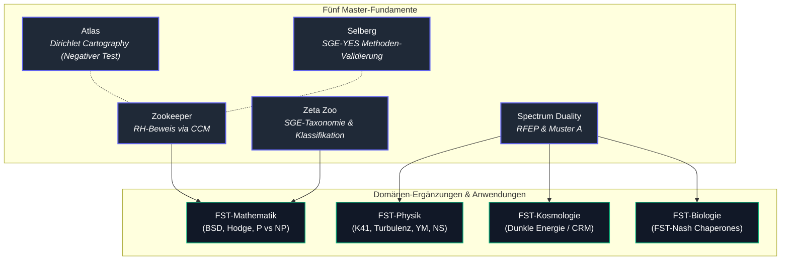

# Funktionelle Stabilitätstheorie (FST)

[English](README.md) | Deutsch

> [!NOTE]
> **KI- / LLM-Integration & Maschinenlesbarer Kontext**: Ein maschinenlesbarer Index für LLMs, Suchmaschinen und automatisierte Crawler wird in [`llms.txt`](llms.txt) gepflegt. Er enthält Gültigkeitsgrenzen, Suchbegriffe, Konzept-DOIs und Abgrenzungshinweise.

Die **Funktionelle Stabilitätstheorie (FST)** ist ein einheitliches mathematisches Forschungsprogramm, das eine zentrale strukturelle Herausforderung — *Funktionelle Positivität unter Eichbedingung* (Muster A / Pattern A) — als gemeinsamen Kern offener Probleme in Zahlentheorie, mathematischer Physik und Kosmologie identifiziert.

## Einstieg

| Wenn Sie suchen nach... | Beginnen Sie mit | Warum |
|-------------------------|------------------|-------|
| der Programmübersicht | [Fünf Master-Arbeiten](#die-fünf-master-arbeiten) | Die Kernfundamente und ihre aktuellen Zenodo Konzept-DOIs |
| der mathematischen Klassifikation | [`masters/zeta-zoo/`](masters/zeta-zoo/) | SGE-Taxonomie, UCU und Grenzwerte der Zeta-Familie |
| dem RFEP / Muster-A-Fundament | [`masters/spectrum-duality/`](masters/spectrum-duality/) | Renormiertes Freie-Energie-Prinzip (RFEP), DS1–DS3 und physikalische Normalform |
| numerischen Reproduzierbarkeitsskripten | [Numerische Validierungsskripte](#numerische-validierungsskripte) | Skriptindex für CCM, K41, Yang-Mills, Navier-Stokes, Dunkle Energie, BSD, Hodge und SAT-Analysen |
| maschinenlesbarem Repository-Kontext | [`llms.txt`](llms.txt) | Suchbegriffe, Systemgrenzen, DOI-Anker und Disambiguierung |

Dies ist ein Forschungs-Quellcode-Repository und kein installierbares Software-Paket. Der Status variiert je nach Arbeit und Ordner: Manche Beiträge sind veröffentlichte Zenodo-Datensätze, manche sind öffentliche Preprints vor Zenodo, und mehrere Domänen-Ergänzungen bleiben an benannten Brückenschritten explizit konditional.

## Auffindbarkeit & Entdeckungskontext

Nutzen Sie den kanonischen GitHub-Pfad `research-line/functional-stability-theory`, wenn Sie auf dieses Repository verlinken. Allgemeine Websuchen nach "functional stability theory" überschneiden sich mit Regelungstechnik, Lyapunov-Stabilität und Ingenieurliteratur, während FST-spezifische Arbeiten über GitHub, Zenodo-Verzeichnisse und wissenschaftliche Indizes auffindbar sind. Nützliche Suchbegriffe:

- `research-line functional-stability-theory`
- `Functional Stability Theory RFEP GitHub`
- `Functional Stability Theory Renormalized Free-Energy Principle`
- `FST Spectrum Duality RFEP Zenodo`
- `Zeta Zoo SGE taxonomy Functional Stability Theory`
- `Spectral Zookeeper CCM microcluster closure`

Bei Zitierungen bevorzugen Sie bitte die unten angegebenen Konzept-DOIs für Arbeiten sowie diese Repository-URL für Quellcode, Skripte und öffentliche Reproduzierbarkeit.

## Die Fünf Master-Arbeiten

Das Programm stützt sich auf fünf zentrale Master-Fundamente. Alle DOIs unten sind **Konzept-DOIs**, die stets zur neuesten Version auf Zenodo auflösen.

| Master | Titel | Rolle | Konzept-DOI |
|--------|-------|-------|-------------|
| [**Zookeeper**](masters/zookeeper/) | The Spectral Zookeeper | RH-Beweis via CCM-Mikrocluster-Schließung | [10.5281/zenodo.19673126](https://doi.org/10.5281/zenodo.19673126) |
| [**Zeta Zoo**](masters/zeta-zoo/) | The Zeta Zoo — The Mathematical Side of FST | Klassifikation (SGE-Taxonomie, Grenztextsätze) | [10.5281/zenodo.19673226](https://doi.org/10.5281/zenodo.19673226) |
| [**Spectrum Duality**](masters/spectrum-duality/) | FST Spectrum Duality / RFEP | Physikalische Instanziierung (Muster A, DS1–DS3) | [10.5281/zenodo.19036190](https://doi.org/10.5281/zenodo.19036190) |
| [**Atlas**](masters/atlas/) | Dirichlet Character Atlas | Mikrokartographie (Galerkin-Diagnostik; negativer Methodentest) | [10.5281/zenodo.19960809](https://doi.org/10.5281/zenodo.19960809) |
| [**Selberg**](masters/selberg/) | NE-B Failure as Hilbert–Pólya Detection | SGE-YES-Validierung (v2.0 Universalität auf Selberg-Zeta) | [10.5281/zenodo.19962588](https://doi.org/10.5281/zenodo.19962588) |

**Atlas + Selberg bilden das Methoden-Validierungspaar**: Atlas ist der *negative* Test (Galerkin-Diagnostik führender Ordnung reicht für Dirichlet-Charaktere nicht aus), Selberg ist der *positive* Test (v2.0 reproduziert ein klassisches Operatorergebnis für Selberg-Zeta).

## Domänen-Ergänzungen

### FST-Mathematik

Klassifiziert durch die SGE-Taxonomie des Zeta Zoo. Diese instanziieren Muster A auf zahlentheoretischen und algebraischen Strukturen. BSD, Hodge und P vs NP sind *Brücken-Spezies* — sie treten sowohl im mathematischen als auch im physikalischen Zweig auf.

| Arbeit | Version | Status | Offenes Problem | Konzept-DOI |
|--------|---------|--------|-----------------|-------------|
| [**BSD**](fst-mathematics/bsd/) | v1.2 Candidate | Reformulierung; Rang ≤ 1 verifiziert | Höhere Gross–Zagier (Rang ≥ 2) | [10.5281/zenodo.19087443](https://doi.org/10.5281/zenodo.19087443) |
| [**Hodge**](fst-mathematics/hodge/) | v1.3 Candidate | Einfache Richtung + AP=AbsHodge | Schwere Richtung jenseits Deligne | [10.5281/zenodo.19087439](https://doi.org/10.5281/zenodo.19087439) |
| [**P vs NP**](fst-mathematics/p-vs-np/) | v1.5 | Reformulierung | Uniformitäts-Brücke | [10.5281/zenodo.19056809](https://doi.org/10.5281/zenodo.19056809) |

### FST-Physik

Leiten Muster A + DS1–DS3 aus der Spektraldualität ab. Diese instanziieren das Prinzip der dissipativen Selektion auf physikalischen Systemen.

| Arbeit | Version | Status | Offenes Problem | Konzept-DOI |
|--------|---------|--------|-----------------|-------------|
| [**K41 Variational Minimiser**](fst-physics/k41-variational-minimiser/) | v1.0 | Preprint aktiv | Unkonditioneller Variationssatz | [10.5281/zenodo.20131305](https://doi.org/10.5281/zenodo.20131305) |
| [**Turbulenz / DFC Kaskade**](fst-physics/turbulence/) | v1.4 Candidate | Konditionaler Begleiter | DFC-Projektionsbrücke | [10.5281/zenodo.19056813](https://doi.org/10.5281/zenodo.19056813) |
| [**Yang–Mills**](fst-physics/yang-mills/) | v2.6 | Konditional | Volumenunabhängige lokale Transferlücke | [10.5281/zenodo.19087433](https://doi.org/10.5281/zenodo.19087433) |
| [**Navier–Stokes**](fst-physics/navier-stokes/) | v2.2 Candidate | Konditional | Annahme G2 (Projektionsregularität) | [10.5281/zenodo.19087449](https://doi.org/10.5281/zenodo.19087449) |
| [**NS Log-Distanz**](fst-physics/navier-stokes/) | v1.3 | Proof of Life | TLL für 3D NS analytisch offen | [10.5281/zenodo.19056807](https://doi.org/10.5281/zenodo.19056807) |

### FST-Kosmologie

Der kosmologische Zweig von FST. Die Arbeit zur Dunklen Energie instanziiert Muster B auf kosmologischen Screening-Mechanismen (Hu–Sawicki f(R) Gravitation).

| Arbeit | Version | Status | Offenes Problem | Konzept-DOI |
|--------|---------|--------|-----------------|-------------|
| [**Dunkle Energie**](fst-cosmology/dark-energy/) | v1.10 Candidate | Framework Note | Hu–Sawicki Thin-Shell + RG-Matching quantitativ offen | [10.5281/zenodo.19036235](https://doi.org/10.5281/zenodo.19036235) |

### FST-Biologie

Die eigenständige spieltheoretische Chaperon-Arbeit ist veröffentlicht: **FST-Nash** — *Game-Theoretic Diagnostics for Chaperone Systems* ([DOI: 10.5281/zenodo.20402751](https://doi.org/10.5281/zenodo.20402751)). Code und Ergebnisse: [`research-line/fst-nash`](https://github.com/research-line/fst-nash).

### FST-Chemie

Geplant. Siehe [`fst-chemistry/`](fst-chemistry/).

## Beweisarchitektur

## Numerische Validierungsskripte

| Skript | Arbeit | Beschreibung |
|--------|--------|--------------|
| `masters/zookeeper/scripts/` | Zookeeper | CCM-Mikrocluster-Schließungs-Pipeline; Ergebnisse in `masters/zookeeper/results/` |
| `scripts/k41/compute_F_spectrum.py` | K41 Variational Minimiser | K41 als eindeutiger Minimierer von F[E]; Test der strikten Konvexität |
| `scripts/turbulence/compute_goy_shell_dfc.py` | Turbulenz / DFC Kaskade | Sabra/GOY Shell-Modell DFC1/DFC2 Verifikation |
| `scripts/yang-mills/compute_dobrushin_su2.py` | Yang-Mills | SU(2) Gitter-Dobrushin Einfluss-Scan und Lückenplot |
| `scripts/dark-energy/compute_w_vs_desi.py` | Dunkle Energie | w_eff(z) Vergleich mit DESI-Grenzdaten |
| `scripts/bsd/compute_height_saturation.py` | BSD | Höhensättigungstest für quadratische Twists |
| `scripts/hodge/compute_ghr_spectrum.py` | Hodge | GHR-Spektrum numerische Verifikation |
| `scripts/p-vs-np/compute_sat_entropy.py` | P vs NP | SAT-Slice-Entropieexperiment am 3-SAT-Phasenübergang |

## Relevante Repositories

- [rh-even-dominance](https://github.com/research-line/rh-even-dominance) — Riemannsche Vermutung: Gerade-Dominanz-Beweis (Fundament)
- [crm-cosmology](https://github.com/research-line/crm-cosmology) — Cooperative Renormalization Model (Fundament)
- [fst-nash](https://github.com/research-line/fst-nash) — Spieltheoretische Diagnostik für Chaperon-Systeme (FST-Biologie; [DOI: 10.5281/zenodo.20402751](https://doi.org/10.5281/zenodo.20402751))

## Autor

Lukas Geiger — ORCID: [0009-0005-7296-1534](https://orcid.org/0009-0005-7296-1534)

## Lizenz

[CC-BY-4.0](https://creativecommons.org/licenses/by/4.0/)
