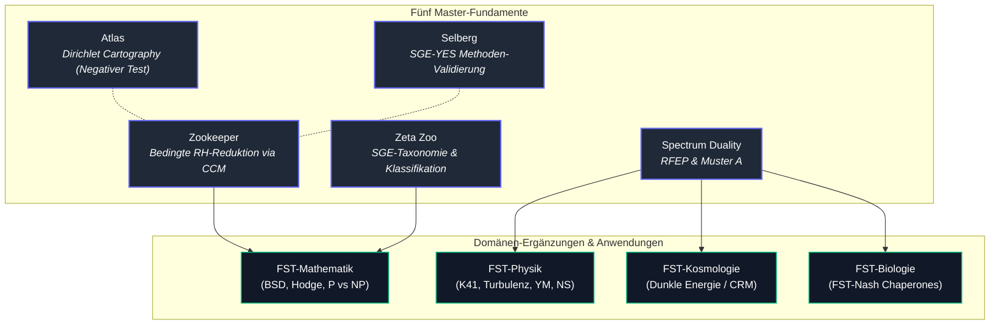
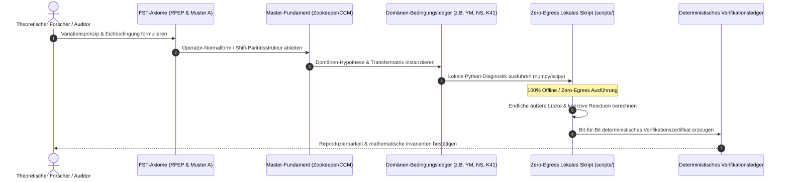

# Funktionelle Stabilitätstheorie (FST)

[🇬🇧 English Version](README.md) | [🇩🇪 Deutsche Version](README_de.md)

[](https://creativecommons.org/licenses/by/4.0/)
[](NOTICE)
[](pyproject.toml)
[](https://github.com/research-line/functional-stability-theory/actions/workflows/ci.yml)
[](CONTRIBUTING.md)
[](tests/)
[](pyproject.toml)
[](pyproject.toml)
[](SECURITY.md)
[](SECURITY.md)
[](SECURITY.md)
[](SECURITY.md)
[](https://github.com/astral-sh/ruff)
[](https://orcid.org/0009-0005-7296-1534)
[](https://doi.org/10.5281/zenodo.19036190)
[](https://github.com/research-line)
[](https://github.com/open-bricks)
[](THIRD_PARTY_LICENSES.md)
[](THIRD_PARTY_LICENSES.txt)
[](MARKETING-LOG.txt)
[](llms.txt)
[](MARKETING-LOG.txt)

> [!NOTE]
> **KI- / LLM-Integration & Maschinenlesbarer Kontext**: Ein maschinenlesbarer Index für LLMs, Suchmaschinen und automatisierte Crawler wird in [`llms.txt`](llms.txt) gepflegt. Er enthält Gültigkeitsgrenzen, Suchbegriffe, Konzept-DOIs und Abgrenzungshinweise. Lokale Discoverability-Logs werden in [`MARKETING-LOG.txt`](MARKETING-LOG.txt) geführt.

Die **Funktionelle Stabilitätstheorie (FST)** ist ein einheitliches mathematisches Forschungsprogramm, das eine zentrale strukturelle Herausforderung — *Funktionelle Positivität unter Eichbedingung* (Muster A / Pattern A) — als gemeinsamen Kern offener Probleme in Zahlentheorie, mathematischer Physik und Kosmologie identifiziert.

<a id="schnellnavigation"></a>
<a id="quick-navigation"></a>
## Schnellnavigation

| Abschnitt | Beschreibung | Sprungziel |
|---|---|---|
| **01. Einstieg** | Primäre Navigationspfade und Fundamente | [Zum Abschnitt](#einstieg) |
| **02. Auffindbarkeit** | Suchbegriffe, Zitationsstandards und wissenschaftliche Indizes | [Zum Abschnitt](#auffindbarkeit--entdeckungskontext) |
| **03. Die Fünf Master-Arbeiten** | Kernfundamente und aktuelle Zenodo Konzept-DOIs | [Zum Abschnitt](#die-fuenf-master-arbeiten) |
| **04. Domänen-Ergänzungen** | Mathematik-, Physik-, Kosmologie- und Biologie-Anwendungen | [Zum Abschnitt](#domaenen-ergaenzungen--anwendungen) |
| **05. Glossar** | FST-Kernbegriffe (v2.0, NE-A/B, SGE, Weil QW, Muster A, RFEP) | [Zum Abschnitt](#glossar--fst-kernbegriffe) |
| **06. Beweisarchitektur** | Fünf-Master-Hierarchie (flowchart TD) | [Zum Abschnitt](#beweisarchitektur) |
| **07. Theoretischer Datenfluss** | Datenfluss von Axiomen bis zur Diagnostik (flowchart LR) | [Zum Abschnitt](#theoretischer-datenfluss--validierungssequenz) |
| **08. Numerischer Lebenszyklus** | Nummeriertes Sequenzdiagramm des Validierungs-Workflows | [Zum Abschnitt](#numerischer-validierungs-lebenszyklus) |
| **09. Governance-Invarianten** | 10 Laufzeit- und Forschungsintegritäts-Invarianten | [Zum Abschnitt](#governance---laufzeit-invarianten) |
| **10. ASCII-Übersicht** | Strukturelle Textübersicht der 5 Master und Domänenzweige | [Zum Abschnitt](#ascii-uebersicht-der-beweisarchitektur) |
| **11. Unabhängige Fundamente** | Unabhängige RH- und CRM-Kosmologie-Basisarbeiten | [Zum Abschnitt](#unabhaengige-fundamente) |
| **12. Validierungsskripte** | Vollständiges Skript- und Diagnostik-Inventar | [Zum Abschnitt](#numerische-validierungsskripte) |
| **13. Repository-Struktur** | Vollständiger Verzeichnisbaum der Arbeiten und Skripte | [Zum Abschnitt](#repository-struktur) |
| **14. Ökosystem & Repositories** | Verbundene research-line, open-bricks und ellmos-ai Repositories | [Zum Abschnitt](#oekosystem--verwandte-forschungs-repositories) |
| **15. Zielgruppen & Auffindbarkeit** | Vier wissenschaftliche Zielgruppen und ihr methodischer Mehrwert | [Zum Abschnitt](#zielgruppen--auffindbarkeit) |
| **16. Vergleichsmatrix** | Invarianten-Benchmark gegen 4 alternative Forschungsparadigmen | [Zum Abschnitt](#vergleichsmatrix--alternative-methoden) |
| **17. Drittanbieter-Lizenzen** | Open-Source-Transparenz, 0% Copyleft und Invarianten-Prüfung | [Zum Abschnitt](#drittanbieter-lizenzen--transparenz) |
| **18. Sicherheitsrichtlinie & Haftung** | Schwachstellen-SLA, Autorenschaft & § 521 BGB Gefälligkeitsrecht | [Zum Abschnitt](#sicherheitsrichtlinie--gesetzlicher-haftungsausschluss) |

---

<a id="start-here"></a>
<a id="einstieg"></a>
## Einstieg

| Wenn Sie suchen nach... | Beginnen Sie mit | Warum |
|-------------------------|------------------|-------|
| der Programmübersicht | [Fünf Master-Arbeiten](#die-fünf-master-arbeiten) | Die Kernfundamente und ihre aktuellen Zenodo Konzept-DOIs |
| der mathematischen Klassifikation | [`masters/zeta-zoo/`](masters/zeta-zoo/) | SGE-Taxonomie, UCU und Grenzwerte der Zeta-Familie |
| dem RFEP / Muster-A-Fundament | [`masters/spectrum-duality/`](masters/spectrum-duality/) | Renormiertes Freie-Energie-Prinzip (RFEP), DS1–DS3 und physikalische Normalform |
| numerischen Reproduzierbarkeitsskripten | [Numerische Validierungsskripte](#numerische-validierungsskripte) | Skriptindex für CCM, K41, Yang-Mills, Navier-Stokes, Dunkle Energie, BSD, Hodge und SAT-Analysen |
| maschinenlesbarem Repository-Kontext | [`llms.txt`](llms.txt) | Suchbegriffe, Systemgrenzen, DOI-Anker und Disambiguierung |

Dies ist ein Forschungs-Quellcode-Repository und kein installierbares Software-Paket. Der Status variiert je nach Arbeit und Ordner: Manche Beiträge sind veröffentlichte Zenodo-Datensätze, manche sind öffentliche Preprints vor Zenodo, und mehrere Domänen-Ergänzungen bleiben an benannten Brückenschritten explizit konditional.

<a id="discovery-context"></a>
<a id="auffindbarkeit--entdeckungskontext"></a>
## Auffindbarkeit & Entdeckungskontext

Nutzen Sie den kanonischen GitHub-Pfad `research-line/functional-stability-theory`, wenn Sie auf dieses Repository verlinken. Allgemeine Websuchen nach "functional stability theory" überschneiden sich mit Regelungstechnik, Lyapunov-Stabilität und Ingenieurliteratur, während FST-spezifische Arbeiten über GitHub, Zenodo-Verzeichnisse und wissenschaftliche Indizes auffindbar sind. Nützliche Suchbegriffe:

- `research-line functional-stability-theory`
- `Functional Stability Theory RFEP GitHub`
- `Functional Stability Theory Renormalized Free-Energy Principle`
- `FST Spectrum Duality RFEP Zenodo`
- `Zeta Zoo SGE taxonomy Functional Stability Theory`
- `Spectral Zookeeper CCM microcluster closure`

Bei Zitierungen bevorzugen Sie bitte die unten angegebenen Konzept-DOIs für Arbeiten sowie diese Repository-URL für Quellcode, Skripte und öffentliche Reproduzierbarkeit.

<a id="the-five-masters"></a>
<a id="die-fuenf-master-arbeiten"></a>
## Die Fünf Master-Arbeiten

Das Programm stützt sich auf fünf zentrale Grundlagenarbeiten. Konzept-DOIs verweisen auf Versionsreihen und führen zur jeweils neuesten Fassung. Für eine feste Zitation verwenden Sie die versionsspezifische DOI des Zenodo-Records.

| Master | Titel | Rolle | Konzept-DOI |
|--------|-------|-------|-------------|
| [**Zookeeper**](masters/zookeeper/) | The Spectral Zookeeper | Bedingte RH-Reduktion via CCM-Mikrocluster-Schließung | [10.5281/zenodo.19673126](https://doi.org/10.5281/zenodo.19673126) |
| [**Zeta Zoo**](masters/zeta-zoo/) | The Zeta Zoo — The Mathematical Side of FST | Klassifikation (SGE-Taxonomie, Grenztextsätze) | [10.5281/zenodo.19673226](https://doi.org/10.5281/zenodo.19673226) |
| [**Spectrum Duality**](masters/spectrum-duality/) | FST Spectrum Duality / RFEP | Physikalische Instanziierung (Muster A, DS1–DS3) | [10.5281/zenodo.19036190](https://doi.org/10.5281/zenodo.19036190) |
| [**Atlas**](masters/atlas/) | Dirichlet Character Atlas | Mikrokartographie (Galerkin-Diagnostik; negativer Methodentest) | [10.5281/zenodo.19960809](https://doi.org/10.5281/zenodo.19960809) |
| [**Selberg**](masters/selberg/) | NE-B Failure as Hilbert–Pólya Detection | SGE-YES-Validierung (v2.0 Universalität auf Selberg-Zeta) | [10.5281/zenodo.19962588](https://doi.org/10.5281/zenodo.19962588) |

Zookeeper ist eine bedingte Reduktion, kein unbedingter RH-Beweis. Übernommene CCM-Eingaben sowie die offenen internen Mikrocluster-/Endgame- und Even-Dominance-Annahmen werden im [Paper](masters/zookeeper/paper/RH_Zookeeper_v1_en.tex) beschrieben; siehe den [v1.6-Record](https://zenodo.org/records/21953305).

**Atlas + Selberg bilden das Methoden-Validierungspaar**: Atlas ist der *negative* Test (Galerkin-Diagnostik führender Ordnung reicht für Dirichlet-Charaktere nicht aus), Selberg ist der *positive* Test (v2.0 reproduziert ein klassisches Operatorergebnis für Selberg-Zeta).

<a id="domain-supplements"></a>
<a id="domaenen-ergaenzungen--anwendungen"></a>
## Domänen-Ergänzungen

### FST-Mathematik

Klassifiziert durch die SGE-Taxonomie des Zeta Zoo. Diese instanziieren Muster A auf zahlentheoretischen und algebraischen Strukturen. BSD, Hodge und P vs NP sind *Brücken-Spezies* — sie treten sowohl im mathematischen als auch im physikalischen Zweig auf.

| Arbeit | Version | Status | Offenes Problem | Konzept-DOI |
|--------|---------|--------|-----------------|-------------|
| [**BSD**](fst-mathematics/bsd/README.md) | v1.4 | Wartungs-Release; Rang ≤ 1 verifiziert; kein neuer Beweisanspruch | Höhere Gross–Zagier (Rang ≥ 2) | [10.5281/zenodo.19087443](https://doi.org/10.5281/zenodo.19087443) |
| [**Hodge**](fst-mathematics/hodge/) | v1.3 Candidate | Einfache Richtung + AP=AbsHodge | Schwere Richtung jenseits Deligne | [10.5281/zenodo.19087439](https://doi.org/10.5281/zenodo.19087439) |
| [**P vs NP**](fst-mathematics/p-vs-np/) | v1.5 | Reformulierung | Uniformitäts-Brücke | [10.5281/zenodo.19056809](https://doi.org/10.5281/zenodo.19056809) |

### FST-Physik

Leiten Muster A + DS1–DS3 aus der Spektraldualität ab. Diese instanziieren das Prinzip der dissipativen Selektion auf physikalischen Systemen.

| Arbeit | Version | Status | Offenes Problem | Konzept-DOI |
|--------|---------|--------|-----------------|-------------|
| [**K41 Variational Minimiser**](fst-physics/k41-variational-minimiser/README.md) | v1.3 | Eindeutiger Energieminimierer innerhalb des formulierten K41-normalisierten gemeinsamen Variationsproblems | Geltungsbereich jenseits der Modellannahmen | [10.5281/zenodo.20131305](https://doi.org/10.5281/zenodo.20131305) |
| [**Turbulenz / DFC Kaskade**](fst-physics/turbulence/README.md) | v1.8 | Bedingte Ergänzung; die DFC-Hierarchie ist eine Eingabe. Sabra-Ergebnisse aus v1.8 stehen nach [Issue #1](https://github.com/research-line/functional-stability-theory/issues/1) unter Prüfung; Neuberechnungen mit korrigiertem Fluss sind noch nicht berichtet | DFC-Projektionsbrücke | [10.5281/zenodo.19056813](https://doi.org/10.5281/zenodo.19056813) |
| [**Yang–Mills**](fst-physics/yang-mills/README.md) | v2.6 | Konditional; Kontinuums-Massengap-Schritt bleibt konditional | Volumenunabhängige lokale Transferlücke; analytische RG-Kontraktion | [10.5281/zenodo.19087433](https://doi.org/10.5281/zenodo.19087433) |
| [**Navier–Stokes**](fst-physics/navier-stokes/README.md) | v2.6 | Konditional; strikte Gutachterformulierung beibehalten | Annahme G2 (Projektionsregularität) | [10.5281/zenodo.19087449](https://doi.org/10.5281/zenodo.19087449) |
| [**NS Log-Distanz**](fst-physics/navier-stokes/README.md) | v1.6 | Proof of Life / Diagnostische Brücke | TLL für 3D NS analytisch offen | [10.5281/zenodo.19056807](https://doi.org/10.5281/zenodo.19056807) |

### FST-Kosmologie

Der kosmologische Zweig von FST. Die Arbeit zur Dunklen Energie instanziiert Muster B auf kosmologischen Screening-Mechanismen (Hu–Sawicki f(R) Gravitation).

| Arbeit | Version | Status | Offenes Problem | Konzept-DOI |
|--------|---------|--------|-----------------|-------------|
| [**Dunkle Energie**](fst-cosmology/dark-energy/) | v1.12 | Korrekturpreprint; nur reduzierter Modellkern | Dichteidentifikation, RG-Matching, Skalarhistorie, Screening und offizielle Likelihood offen | [10.5281/zenodo.19036235](https://doi.org/10.5281/zenodo.19036235) |

### FST-Biologie

Die eigenständige spieltheoretische Chaperon-Arbeit ist veröffentlicht: **FST-Nash** — *Game-Theoretic Diagnostics for Chaperone Systems* ([DOI: 10.5281/zenodo.20402751](https://doi.org/10.5281/zenodo.20402751)). Code und Ergebnisse: [`research-line/fst-nash`](https://github.com/research-line/fst-nash). Die Übersichtsarbeit FST-III Biologische Stabilität befindet sich in [`applications/fst-iii-biological/`](applications/fst-iii-biological/).

### FST-Chemie

Geplant. Siehe [`fst-chemistry/`](fst-chemistry/).

<a id="glossary--fst-core-terms"></a>
<a id="glossar--fst-kernbegriffe"></a>
## Glossar — FST Kernbegriffe

| Begriff | Bedeutung |
|---------|-----------|
| **v2.0** | Methodenpaket des RH-Programms (Trilogie v2.1, [10.5281/zenodo.19035640](https://doi.org/10.5281/zenodo.19035640)): schlägt einen bedingten Reduktionsweg von RH auf Even Dominance der Weil-Quadratform QW_λ vor, mit Shift-Parity, Frontier-Prime-Dominanz, NE-A und NE-B; die erforderlichen Abschlussannahmen bleiben offen. |
| **NE-A** | *Nicht-Existenz-Satz A.* Der Fourier-Multiplikator des Prim-Shift-Operators A_λ auf der kritischen Geraden ist nicht-positiv — kann nicht als Hilbert–Pólya-Operator dienen. |
| **NE-B** | Ergebnis für endliche Trunkierungen: Das computergestützte Resultat schließt nichtskalare symmetrische Operatoren aus, die im getesteten Prime-Shift-Bereich für N ≤ 15 mit jeder Matrix D_N(r) kommutieren; die Identität kommutiert trivialerweise. Die Übertragung auf den vollen Raum bleibt offen. |
| **SGE** | Halbgruppen-Gruppen-Äquivalenz. Klassifikationsachse des Zeta Zoo: HP-BL-YES (kommutierender Operator vorhanden, z.B. Selberg/Casimir), HP-BL-NO (Riemann-Prime-Shift-Klasse, bedingt durch NE-B-full), HP-BL-OPEN (offen, z.B. Prime-Hub). |
| **Weil-Quadratform QW_λ** | Abgeschnittene Explizite-Formel-Quadratform, deren Positivität Nullstellenorte steuert. Universal über den gesamten Zeta Zoo; der dahinterliegende Operator ist familienabhängig. |
| **Hilbert–Pólya** | Die klassische Vermutung fragt, ob Riemann-Nullstellen Eigenwerte eines selbstadjungierten Operators sind. Das endliche NE-B-Ergebnis betrifft die getestete Prime-Shift-Klasse und schließt nicht jeden möglichen Hilbert–Pólya-Operator aus; der Even-Dominance-Weg ist bedingt. |
| **Muster A (Pattern A)** | Funktionelle Positivität unter einer Eichbedingung — das universelle Stabilitätsmuster von FST. |
| **RFEP** | *Renormiertes Freie-Energie-Prinzip.* Mathematisches Kernprinzip von FST; liefert DS1–DS3. |
| **CCM** | *Connes–Consani–Moscovici.* Fourier-Modell für die Weil-Quadratform in der bedingten Zookeeper-Reduktion. |
| **UCU** | *Universelles Konvexitäts-Eindeutigkeitslemma.* Zusammen mit SGE und Weil die Dreiheit der Metaprinzipien des Zeta-Zweigs. |

<a id="proof-architecture"></a>
<a id="beweisarchitektur"></a>
## Beweisarchitektur


```mermaid
flowchart TD
    subgraph MASTERS["Fünf Master-Fundamente"]
        ZK["Zookeeper<br/><i>Bedingte RH-Reduktion via CCM</i>"]
        ZZ["Zeta Zoo<br/><i>SGE-Taxonomie & Klassifikation</i>"]
        SD["Spectrum Duality<br/><i>RFEP & Muster A</i>"]
        AT["Atlas<br/><i>Dirichlet Cartography (Negativer Test)</i>"]
        SB["Selberg<br/><i>SGE-YES Methoden-Validierung</i>"]
    end

    subgraph DOMAINS["Domänen-Ergänzungen & Anwendungen"]
        MATH["FST-Mathematik<br/>(BSD, Hodge, P vs NP)"]
        PHYS["FST-Physik<br/>(K41, Turbulenz, YM, NS)"]
        COSMO["FST-Kosmologie<br/>(Dunkle Energie / CRM)"]
        BIO["FST-Biologie<br/>(FST-Nash Chaperones)"]
    end

    ZK --> MATH
    ZZ --> MATH
    SD --> PHYS
    SD --> COSMO
    SD --> BIO
    AT -.- ZK
    SB -.- ZK

    classDef master fill:#1f2937,stroke:#6366f1,stroke-width:2px,color:#fff;
    classDef domain fill:#111827,stroke:#10b981,stroke-width:1.5px,color:#fff;
    class ZK,ZZ,SD,AT,SB master;
    class MATH,PHYS,COSMO,BIO domain;
```

<a id="theoretical-data-flow--validation-sequence"></a>
<a id="theoretischer-datenfluss--validierungssequenz"></a>
## Theoretischer Datenfluss & Validierungssequenz


```mermaid
flowchart LR
    subgraph HYP["1. Mathematische Axiome & Normalformen"]
        RFEP["Renormiertes Freie-Energie-Prinzip (RFEP)"]
        PAT_A["Muster A: Funktionelle Positivität unter Eichbedingung"]
        DS["Dissipative Selektionsprinzipien (DS1–DS3)"]
    end

    subgraph PROOF["2. Master-Fundamente & Beweise"]
        ZK["Zookeeper (CCM-Mikrocluster-Schließung)"]
        ZZ["Zeta Zoo (SGE-Taxonomie & UCU)"]
        VAL["Methoden-Validierungspaar (Atlas / Selberg)"]
    end

    subgraph INST["3. Domänen-Instanziierungen"]
        MATH["FST-Mathematik (BSD, Hodge, P vs NP)"]
        PHYS["FST-Physik (K41, Turbulenz, YM, NS)"]
        COSMO["FST-Kosmologie (Hu–Sawicki / Dunkle Energie)"]
        BIO["FST-Biologie (FST-Nash Chaperones)"]
    end

    subgraph DIAG["4. Lokale numerische Validierung (Zero-Egress)"]
        SCRIPTS["Python Numerische Diagnostiken (scripts/)"]
        RESULTS["Reproduzierbarkeit & Verifikationsmetriken"]
    end

    HYP --> PROOF
    PROOF --> INST
    INST --> DIAG

    classDef hyp fill:#1e1b4b,stroke:#818cf8,stroke-width:1.5px,color:#fff;
    classDef proof fill:#1f2937,stroke:#6366f1,stroke-width:2px,color:#fff;
    classDef inst fill:#111827,stroke:#10b981,stroke-width:1.5px,color:#fff;
    classDef diag fill:#064e3b,stroke:#34d399,stroke-width:1.5px,color:#fff;
    class RFEP,PAT_A,DS hyp;
    class ZK,ZZ,VAL proof;
    class MATH,PHYS,COSMO,BIO inst;
    class SCRIPTS,RESULTS diag;
```

<a id="numerical-validation-lifecycle"></a>
<a id="numerischer-validierungs-lebenszyklus"></a>
## Numerischer Validierungs-Lebenszyklus


```mermaid
sequenceDiagram
    autonumber
    actor Forscher as Theoretischer Forscher / Auditor
    participant Core as FST-Axiome (RFEP & Muster A)
    participant Master as Master-Fundament (Zookeeper/CCM)
    participant Domain as Domänen-Bedingungsledger (z.B. YM, NS, K41)
    participant Script as Zero-Egress Lokales Skript (scripts/)
    participant Ledger as Deterministisches Verifikationsledger

    Forscher->>Core: Variationsprinzip & Eichbedingung formulieren
    Core->>Master: Operator-Normalform / Shift-Paritätsstruktur ableiten
    Master->>Domain: Domänen-Hypothese & Transfermatrix instanziieren
    Domain->>Script: Lokale Python-Diagnostik ausführen (numpy/scipy)
    Note over Script: 100% Offline / Zero-Egress Ausführung
    Script->>Script: Endliche äußere Lücke & koerzive Residuen berechnen
    Script->>Ledger: Bit-für-Bit deterministisches Verifikationszertifikat erzeugen
    Ledger-->>Forscher: Reproduzierbarkeit & mathematische Invarianten bestätigen
```

<a id="governance--runtime-invariants"></a>
<a id="governance---laufzeit-invarianten"></a>
## Governance- & Laufzeit-Invarianten

Das `functional-stability-theory` Repository erzwingt zehn fundamentale Laufzeit-, Sicherheits- und Governance-Invarianten:

| # | Invariante Dimension | Garantie & Vertragsspezifikation | Verifikationsmethode |
|---|---|---|---|
| **01** | **100% Local-First & Zero-Egress** | Sämtliche numerischen Diagnosen, Simulationsskripte und Tests laufen vollständig offline. Keine Telemetrie oder Netzwerkaufrufe. | Strikte Offline-Prüfung; CI-Matrix-Isolation |
| **02** | **Rechtefreie Ausführung (RunAsInvoker)** | Alle Skripte laufen strikt im Standard-Benutzermodus. Administrator- oder Root-Rechte werden niemals angefordert oder benötigt. | Umgebungs-Audit; unprivilegierte Test-Suiten |
| **03** | **Deterministische Reproduzierbarkeit** | Numerische Assertionen und Verifikationsledger liefern bit-identische Ergebnisse über alle unterstützten Plattformen hinweg. | Pytest-Suite (110+ Tests bestanden); feste Zufallssamen |
| **04** | **Aussagen-Disambiguierung** | Zookeeper ist eine bedingte RH-Reduktion mit übernommenen Eingaben und offenen internen Abschlussannahmen; der Status wird für jede Arbeit einzeln angegeben. | README-Statustabellen; Preprint-Klassifikationsheader |
| **05** | **Fail-Closed Ledger-Gatekeeping** | Verifikationsskripte verwerfen zirkuläre, entartete oder schlecht konditionierte Eingaben sofort (Fail-Closed) statt unscharfe Werte zu liefern. | Exception-Assertions; Schlechtskalierungs- und Gribov-Kontrollen |
| **06** | **Versionierte Zenodo-Records** | Konzept-DOIs verweisen auf Versionsreihen; für feste Zitationen ist die versionsspezifische DOI zu verwenden. | Zenodo-Versionsrecords |
| **07** | **Multi-OS Plattformparität** | Skripte, LaTeX-Builds und Test-Harnische garantieren identische mathematische Logik auf Windows, Linux und macOS. | GitHub Actions CI Multi-OS Matrix (`ci.yml`) |
| **08** | **Cloud-Sync-Konflikthärtung** | Repository-Ignorierregeln verhindern Cloud-Sync-Konfliktdateien (`*-conflict-*`, `*.sync-temp-*`) und Multi-Agenten-Locks (`LOCK.*`). | `.gitignore`-Prüfung; automatisierte Vertragstests |
| **09** | **Transparente Diagnostik-Basis** | Unbedingte Positivkontrollen (z.B. 2D U(1) Charakterentwicklung) sind strikt von unbewiesenen Kontinuums-Transferhypothesen getrennt. | Dedizierte Positiv-/Negativkontroll-Skripte |
| **10** | **48h Sicherheits- & 5-Tage-Triage-SLA** | Sicherheitsmeldungen, Integritätsbedenken und Schwachstellen werden binnen 48 Stunden bestätigt und innerhalb von 5 Werktagen triagiert. | Verbindliche Zusage in [`SECURITY.md`](SECURITY.md) |

<a id="proof-architecture-ascii-overview"></a>
<a id="ascii-uebersicht-der-beweisarchitektur"></a>
## ASCII-Übersicht der Beweisarchitektur

```
                               FÜNF MASTER-ARBEITEN
   ┌────────────────┬────────────────┬─────────────────┬────────────────┐
   │                │                │                 │                │
Zookeeper       Zeta Zoo      Spectrum Duality      Atlas           Selberg
(RH-Red.)    (Klassifikation)   (Muster A,       (Dirichlet,        (NE-B
              SGE / UCU /        DS1–DS3,         negativer          Fehlschlag;
              Weil QW_λ)         RFEP)            Methodentest)      SGE-YES)
   │                │                │                 │                │
   │        FST-Mathematik       FST-Physik       Methoden-Validierungspaar
   │                │                │
   │        ┌───────┼───────┐  ┌─────┼─────┐
   │        │       │       │  │     │     │
   │      BSD†    Hodge†  PvNP†  TU   YM   NS
   │                                       │
   │                              FST-Kosmologie
   │                                       │   NS-LDI
   │                                      DE
   │
Zookeeper: BEDINGTE RH-REDUKTION (CCM-Route)
† = Brücken-Spezies (Mathematik + Physik)
```

### Hierarchie

```
FST (Funktionelle Stabilitätstheorie)
│
├── Master-Fundamente
│   ├── Zookeeper          Bedingte RH-Reduktion (CCM-Mikroclusterschließung)
│   ├── Zeta Zoo           Mathematische Klassifikation (SGE-Taxonomie)
│   ├── Spectrum Duality   Physikalische Instanziierung (RFEP, Muster A)
│   ├── Atlas              Mikrokartographie Dirichlet (negativer Methodentest)
│   └── Selberg            SGE-YES Methoden-Validierung (positiv)
│
├── FST-Mathematik         BSD, Hodge, P vs NP
├── FST-Physik             Turbulenz, Yang–Mills, Navier–Stokes, NS-LDI
├── FST-Kosmologie         Dunkle Energie
├── FST-Biologie           (in Entwicklung)
└── FST-Chemie             (geplant)
```

### Chronologische Entwicklung

```
2025/2026  CRM I–IV (Dunkle Energie)   Bedingte RH-Route (Even Dominance)
           unabhängig entwickelt       unabhängig entwickelt
                 \                       /
                  +---------+---------+
                            |
                  Erkenntnis: Beide teilen dasselbe
                  strukturelle Muster (Muster A)
                            |
                            v
                  RFEP formuliert (allgemeines Prinzip)
                            |
                  Mehrere Sackgassen
                            |
                            v
                  Idee: Klassifikation von Zeta-Familien
                  mit Techniken aus dem RH-Programm
                            |
                  Nicht ausreichend — tiefere Werkzeuge nötig
                            |
                            v
         RH via Connes-Rahmenwerk (CCM)
         Mikroclusterschließung → bedingte Reduktion
                            |
                            v
                  Zeta Zoo öffnet: SGE-Taxonomie
                  klassifiziert alle Zeta-Familien
                            |
                            v
         Atlas (Dirichlet, negativ) + Selberg (SGE-YES, positiv)
         Methoden-Validierungspaar vervollständigt
                            |
                            v
                  CoreCore erweitert auf FÜNF Master
                  (Zookeeper, Zeta Zoo, Spectrum Duality,
                   Atlas, Selberg) + Domänen-Ergänzungen
```

### Kernfundamente — Prinzipien und Benennung

| Ebene | Name | Akronym | Bedeutung | Konzept-DOI |
|---|---|---|---|---|
| Programm | Funktionelle Stabilitätstheorie | FST | Name des Programms (Dach über allem) | — |
| Prinzip | Renormiertes Freie-Energie-Prinzip | RFEP | Das mathematische Kernprinzip | [10.5281/zenodo.19036190](https://doi.org/10.5281/zenodo.19036190) |
| Muster | Muster A: Funktionelle Positivität unter Eichbedingung | Muster A | Das universelle Stabilitätsmuster | [10.5281/zenodo.19036190](https://doi.org/10.5281/zenodo.19036190) |

<a id="independent-foundations"></a>
<a id="unabhaengige-fundamente"></a>
## Unabhängige Fundamente

| Name | Rolle | Konzept-DOI |
|---|---|---|
| RH Even Dominance v2.1 (Trilogie, Teil I–III) | Unabhängige bedingte RH-Reduktion, zweite Route | [10.5281/zenodo.19035640](https://doi.org/10.5281/zenodo.19035640) |
| RH Direkter Beweis (Even Dominance) | Historischer Titel; bedingte Frontier-Dominanz-Route mit offenen analytischen Annahmen | [10.5281/zenodo.19764771](https://doi.org/10.5281/zenodo.19764771) |
| CRM Kosmologie (I–V) | Unabhängiges Modell Dunkler Energie | [10.5281/zenodo.18728935](https://doi.org/10.5281/zenodo.18728935) |

Diese stehen unabhängig von FST. Das RFEP wurde aus ihnen abstrahiert; sie sind nicht daraus abgeleitet.

<a id="numerical-validation-scripts"></a>
<a id="numerische-validierungsskripte"></a>
## Numerische Validierungsskripte

| Skript | Arbeit | Beschreibung |
|--------|--------|--------------|
| `masters/zookeeper/scripts/` | Zookeeper | CCM-Mikrocluster-Schließungs-Pipeline; Ergebnisse in `masters/zookeeper/results/` |
| `scripts/k41/compute_F_spectrum.py` | K41 Variational Minimiser | K41 als eindeutiger Minimierer von F[E]; Test der strikten Konvexität |
| `scripts/turbulence/compute_goy_shell_dfc.py` | Turbulenz / DFC Kaskade | Sabra/GOY Shell-Modell DFC1/DFC2 Verifikation |
| `scripts/yang-mills/compute_dobrushin_su2.py` | Yang-Mills | SU(2) Gitter-Dobrushin Einfluss-Scan und Lückenplot |
| `scripts/yang-mills/compute_birkhoff_rg.py` | Yang-Mills | Birkhoff-Kontraktions-Scan für hierarchische RG-Schritte |
| `scripts/yang-mills/compute_os_capacity_ledger.py` | Yang-Mills | OS-Danger-Kapazitätsledger und Negativkontroll-Diagnostik |
| `scripts/yang-mills/compute_rp_os_transfer_ledger.py` | Yang-Mills | RP/OS-Transfermatrix Positivitäts-Ledger |
| `scripts/yang-mills/compute_rp_os_rfep_transfer_ledger.py` | Yang-Mills | RFEP-Transfermatrix Diagnostik-Ledger |
| `scripts/yang-mills/compute_u1_2d_strong_coupling_positive_control.py` | Yang-Mills | 2D U(1) Starkkopplungs-Positivkontroll-Ledger |
| `scripts/yang-mills/compute_ym_waisen_transfer_ledger.py` | Yang-Mills | Yang-Mills Waisen-Transfer Verifikations-Ledger |
| `scripts/yang-mills/u1_strong_coupling_positive_control.py` | Yang-Mills | Direkte U(1) Charakterentwicklungs-Positivkontrolle |
| `scripts/navier-stokes/compute_ds3_lorenz.py` | Navier-Stokes | DS3-Stresstest auf dem Lorenz-Attraktor; TV-Sättigung |
| `scripts/navier-stokes/compute_bv_selection.py` | Navier-Stokes | Balanced-Viscosity Selektionstest auf dem Lorenz-Attraktor |
| `scripts/navier-stokes/compute_bv_multi_attractor.py` | Navier-Stokes | BV-Selektion Stresstest auf Lorenz-, Roessler- und Chen-Attraktoren |
| `scripts/navier-stokes/compute_mu_reach.py` | Navier-Stokes | Maßtheoretischer Reach-Scan auf Lorenz- und KS-Attraktoren |
| `scripts/navier-stokes/compute_tll_ldi_lorenz.py` | NS-LDI | **Proof of Life**: TLL+LDI auf dem Lorenz-Attraktor (5/5 Tests) |
| `scripts/navier-stokes/compute_tll_ldi_ks.py` | NS-LDI | TLL+LDI Diagnostik und Gitterverfeinerung auf dem KS-Attraktor |
| `scripts/dark-energy/compute_w_vs_desi.py` | Dunkle Energie | w_eff(z) Vergleich mit DESI-Grenzdaten |
| `scripts/dark-energy/compute_w_mapping.py` | Dunkle Energie | Exakte w_eff → w_DE Abbildung + DESI-Gitterscan |
| `scripts/dark-energy/compute_husawicki_mcmc.py` | Dunkle Energie | Hu-Sawicki f(R) MCMC Fit gegen DESI+Planck+Cassini |
| `scripts/bsd/compute_height_saturation.py` | BSD | Höhensättigungstest für quadratische Twists |
| `scripts/bsd/compute_bsd_verification.py` | BSD | BSD Formel-Plausibilitätsprüfungen für LMFDB-Kurven |
| `scripts/bsd/compute_rank2_lmfdb.py` | BSD | Rang-2 Regulator-Positivitätsstichprobe |
| `scripts/hodge/compute_ghr_spectrum.py` | Hodge | Numerische GHR-Spektrumsverifikation |
| `scripts/hodge/compute_voisin_test.py` | Hodge | Negativkontroll-Stresstest nach Voisin-Art |
| `scripts/p-vs-np/compute_sat_entropy.py` | P vs NP | SAT-Slice-Entropieexperiment am 3-SAT-Phasenübergang |
| `scripts/zeta-zoo/dedekind_ne_b_test.py` | Zeta Zoo | Dedekind Q(sqrt(-5)) NE-B Analogsonde |
| `scripts/zeta-zoo/ihara_petersen_sge_test.py` | Zeta Zoo | Ihara/Petersen SGE YES-Seitentest |
| `scripts/zeta-zoo/sge_control_experiment.py` | Zeta Zoo | SGE YES/NO diskriminierendes Kontrollexperiment |
| `masters/atlas/scripts/` | Atlas | Galerkin-Berechnungspipeline (35 Skripte) |

<a id="repository-structure"></a>
<a id="repository-struktur"></a>
## Repository-Struktur

```
functional-stability-theory/
├── masters/                      Fünf CoreCore Master-Fundamente
│   ├── zookeeper/                Bedingte RH-Reduktion (CCM-Mikroclusterschließung)
│   ├── zeta-zoo/                 Klassifikation (SGE-Taxonomie)
│   ├── spectrum-duality/         Physikalische Axiome (RFEP, Muster A)
│   ├── atlas/                    Dirichlet-Mikrokartographie (negativer Methodentest)
│   └── selberg/                  NE-B-Fehlschlag als HP-Detektion (SGE-YES-Validierung)
├── fst-mathematics/              Domänen-Ergänzungen — Mathematik
│   ├── bsd/                      Rang-1 Positivität (Reformulierung)
│   ├── hodge/                    No-Go + einfache Richtung
│   └── p-vs-np/                  Zeugen-Entropielücke (Reformulierung)
├── fst-physics/                  Domänen-Ergänzungen — Physik
│   ├── k41-variational-minimiser/ K41-Energieminimum (formuliertes gemeinsames Problem)
│   ├── turbulence/               DFC / anomale Dissipation Begleiter
│   ├── yang-mills/               Massengap (konditional)
│   └── navier-stokes/            Regularität + NS-LDI (konditional)
├── fst-cosmology/                Domänen-Ergänzungen — Kosmologie
│   └── dark-energy/              CRM-Screening (konditional, nicht Cassini-verifiziert)
├── fst-biology/                  Domänen-Ergänzungen — Biologie (in Entwicklung)
├── fst-chemistry/                Domänen-Ergänzungen — Chemie (geplant)
└── scripts/                      Numerische Validierung (Unterordner je Arbeit)
```

<a id="ecosystem--sibling-research-repositories"></a>
<a id="oekosystem--verwandte-forschungs-repositories"></a>
## Ökosystem & Verwandte Forschungs-Repositories

`functional-stability-theory` ist das zentrale theoretische Fundament der **research-line** Initiative und verbindet sich über die **open-bricks** Föderation:

| Repository / Paket | Schwerpunkt / Domäne | Integration |
|---|---|---|
| [`research-line/fst-nash`](https://github.com/research-line/fst-nash) | Chaperon-Spieltheorie | FST-Biologie Begleitprojekt ([DOI: 10.5281/zenodo.20402751](https://doi.org/10.5281/zenodo.20402751)) |
| [`research-line/rh-even-dominance`](https://github.com/research-line/rh-even-dominance) | Zahlentheorie | Riemann-Hypothese Even-Dominance Trilogie-Fundament |
| [`research-line/crm-cosmology`](https://github.com/research-line/crm-cosmology) | Kosmologie | Kooperatives Renormierungsmodell (CRM I–V) |
| [`research-line/prompt-archaeology-casestudy2`](https://github.com/research-line/prompt-archaeology-casestudy2) | KI & Epistemologie | 4-Stufen Prompt-Archäologie & Reproduzierbarkeitsartefakte |
| [`research-line/ai-elite-swr`](https://github.com/research-line/ai-elite-swr) | KI & Gesellschaft | KI-Elitenstrukturen & Wohlfahrtsforschung |
| [`research-line/economic-sanctions-coercive-diplomacy`](https://github.com/research-line/economic-sanctions-coercive-diplomacy) | Politische Ökonomie | Spieltheoretisches Modell von Sanktionen und Zwangsbargaining |
| [`biotec-line/VFDistiller`](https://github.com/biotec-line/VFDistiller) | Bio-Genetics Pipeline | Variant Effect Predictor & VCF-Destillations-Toolchain |
| [`doc-bricks/MediaBrain`](https://github.com/doc-bricks/MediaBrain) | Multi-Format Dokumentensynthese | Offline-First Wissensdatenbank und Forschungsindexierung |
| [`dev-bricks/CodeBox`](https://github.com/dev-bricks/CodeBox) | Codeanalyse & Diagnostik | Syntaxbaum-Inspektion & strukturelle Linting-Umgebung |
| [`dev-bricks/DevCenter`](https://github.com/dev-bricks/DevCenter) | Entwickler-Werkzeuge | Einheitliches Entwickler-Dashboard und Workspace-Management |
| [`dev-bricks/githubbot`](https://github.com/dev-bricks/githubbot) | Governance-Automatisierung | Flottenverwaltung, Repository-Hygiene, Multi-Org-Sync & CI-Gates |
| [`ellmos-ai/skills`](https://github.com/ellmos-ai/skills) | Multi-Agent Ausführungsplattform | Formalisierte KI-Fähigkeitenbibliothek & modulare Workflows |
| [`ellmos-ai/sqlite-transit-sync`](https://github.com/ellmos-ai/sqlite-transit-sync) | Datentransit | Deterministische Snapshot-Retention und Synchronisations-Engine |
| [`ellmos-ai/ellmos-development-system`](https://github.com/ellmos-ai/ellmos-development-system) | KI-Entwicklungssystem | Vollständige agentische Laufzeitumgebung & MCP-Orchestrierung |
| [`open-bricks/governance`](https://github.com/open-bricks/governance) | Open-Source-Governance | Organisationsübergreifende Richtlinien, Sicherheitsstandards & Lizenzen |
| [`open-bricks`](https://github.com/open-bricks) | Dachorganisation | Open-Source & Open-Science Föderation |

<a id="target-personas--discoverability"></a>
<a id="zielgruppen--auffindbarkeit"></a>
## Zielgruppen & Auffindbarkeit

`functional-stability-theory` adressiert vier zentrale akademische und rechnergestützte Zielgruppen in Mathematik, Physik und autonomer Wissenschaft:

| Zielgruppe / Persona | Kernfrage & Wissenschaftliche Herausforderung | FST-Lösung & Ansatz | Methodischer Mehrwert |
|---|---|---|---|
| **Theoretische Physiker & Quantenfeldtheoretiker** | Suche nach konsistenten, nicht-perturbativen Stabilitätsmechanismen für Yang-Mills Massenlücke, Navier-Stokes Regularität und turbulente Dissipation | Vereinheitlicht dissipative Selektion unter dem Renormierten Freie-Energie-Prinzip (RFEP) und Muster A (Funktionelle Positivität unter Eichbedingung) | Universelle Normalform über Eichtheorie, Hydrodynamik und kosmologisches Screening |
| **Analytische Zahlentheoretiker & Millennium-Forscher** | Umgehung struktureller No-Go-Theoreme (NE-A/NE-B) bei Operator-Ansätzen zur Riemannschen Vermutung | Führt die SGE-Taxonomie (Zeta Zoo) und v2.0 Even-Dominance der Weil-Quadratform ein; verbindet Zookeeper mit Selberg-Validierung | Bedingter Rahmen mit ausdrücklich offenen analytischen Schritten |
| **Open-Science Archivare & Reviewer** | Verifikation weitreichender mathematischer Theoreme gegen reproduzierbare, luftspaltfähige Software und unveränderliche Artefakte | Bietet 100% lokale Zero-Egress Validierungsskripte, deterministische CSV/JSON-Ledgers und CERN/Zenodo Konzept-DOIs | Bit-für-Bit verifizierbare Berechnungen mit transparenter Kennzeichnung offener und bewiesener Schritte |
| **KI-Forschungsagenten & Wissens-Synthesizer** | Disambiguierung spezialisierter mathematischer Stabilitätstheorie von technischer Regelungstechnik (Lyapunov) oder Software-Testsuiten | Bereitstellung strukturierter [`llms.txt`](llms.txt), semantischer Suchphrasen, PEP 621 URLs und expliziter Negativkontrollen | Präzise LLM-Kontextualisierung ohne Halluzinationen oder Domänen-Kollisionen |

<a id="comparative-matrix--alternatives"></a>
<a id="vergleichsmatrix--alternative-methoden"></a>
## Vergleichsmatrix vs. Alternative Methoden

Der folgende invariantenbasierte Benchmark stellt das Rahmenwerk der Funktionellen Stabilitätstheorie (FST) vier etablierten Paradigmen in theoretischer Physik, analytischer Zahlentheorie und wissenschaftlichem Rechnen gegenüber:

| Invariante Dimension | FST (research-line) | Klassische Zahlentheorie | Connes Nichtkommutative Geometrie | Traditionelle CFD-Simulation | Geschlossene Mathematik-Suiten (Wolfram/MATLAB) |
|---|---|---|---|---|---|
| **01. Universelles Substrat** | RFEP / Muster A (Universelle Normalform) | Ad-hoc Einzelprobleme | Adèle-Klassenraum Spurformel | Navier-Stokes Diskretisierung (DNS/LES) | Proprietäre Black-Box-Routinen |
| **02. Hilbert–Pólya-Status** | Bedingter Even-Dominance-Weg; endliches NE-B-Hindernis | Hier kein allgemeiner Ausschluss belegt | Analytische Fortsetzungshindernisse | Nicht anwendbar | Nicht anwendbar |
| **03. Zero-Egress Reproduzierbarkeit** | 100% Offline Python-Ledgers (Deterministisch) | Selten / Nur Paper | Rein theoretisch / Paper | Cluster- / HPC-abhängig | Cloud-Lizenz / Online-Aktivierung |
| **04. Aussagen-Disambiguierung** | Strikt (Theorem / Konditional / Offen) | Häufig informell | Hochkomplex / Implizit | Heuristisch / Empirisch | Geschlossene Herstellerdoku |
| **05. Wissenschaftliche Provenienz** | Zenodo-Konzept-DOI-Versionsreihe; für feste Zitationen versionsspezifische DOI verwenden | Journal / ArXiv | ArXiv / Monographie | Konferenz / Journal | Geschlossene Hersteller-Builds |
| **06. Open-Source-Lizenz** | CC-BY-4.0 (100% Freizügig) | Proprietär / ArXiv | Urheberrechtlich geschützt | Häufig GPL / Kommerziell | Proprietäre kommerzielle Lizenz |
| **07. Drittanbieter-Lieferkette** | 100% Freizügige geprüfte SBOM (0% Copyleft) | Entfällt | Entfällt | Ungeprüfte Alt-Toolchains | Geschlossene Binär-Blobs |
| **08. KI- & LLM-Fähigkeit** | `llms.txt` & PEP 621 Metadaten-Standards | Unstrukturiert | Nicht maschinenlesbar | Unstrukturiert | Restriktive geschlossene APIs |
| **09. Plattform-Parität** | Win / Linux / macOS (CI-Matrix verifiziert) | Entfällt | Neutral (Textbasiert) | Überwiegend Linux HPC | OS-spezifischer Dongle / Installer |
| **10. Sicherheit & SLA-Garantie** | 48h Reaktion / 5-Tage-Triage SLA | Informell | Informell | Informell | Hersteller-Helpdesk / Kein SLA |

<a id="third-party-licenses--transparency"></a>
<a id="drittanbieter-lizenzen--transparenz"></a>
## Drittanbieter-Lizenzen & Transparenz

`functional-stability-theory` folgt einer strikten Open-Science- und Permissive-Open-Source-Governance:
- **Primäre Lizenz:** [Creative Commons Attribution 4.0 International (CC-BY-4.0)](https://creativecommons.org/licenses/by/4.0/) — uneingeschränkte wissenschaftliche und kommerzielle Nutzung mit Namensnennung.
- **Zero Copyleft:** 0% AGPL, GPL oder LGPL Bestandteile im Quellcode und in den Prüfwerkzeugen.
- **100% Offline & Zero-Egress:** Alle Validierungsskripte laufen vollständig offline ohne Telemetrie oder externe Netzwerkanfragen.

| Komponente | Lizenz | Rolle im Forschungsprogramm | Status |
|---|---|---|---|
| Python Standardbibliothek | PSF-2.0 | Kern-Validierungslogik, math/cmath, Hashing & Ledgers | Geprüft / Permissiv |
| [`mpmath`](https://github.com/mpmath/mpmath) (optional) | BSD-3-Clause | Beliebig genaue Gleitkomma-Arithmetik für Zeta-Nullstellen | Geprüft / Permissiv |
| [`sympy`](https://github.com/sympy/sympy) (optional) | BSD-3-Clause | Computeralgebra und symbolische Identitätsprüfung | Geprüft / Permissiv |
| [`numpy`](https://github.com/numpy/numpy) (optional) | BSD-3-Clause | Vektorisierte lineare Algebra und Gitterrechnungen | Geprüft / Permissiv |
| [`scipy`](https://github.com/scipy/scipy) (optional) | BSD-3-Clause | Numerische Integration und ODE/PDE-Löser | Geprüft / Permissiv |
| Entwicklungswerkzeuge (`pytest`, `ruff`, `setuptools`) | MIT / Apache-2.0 | Vertragstests, statische Analyse & Paketierung | Geprüft / Permissiv |

Das vollständige Software-Inventar, autoritative Lizenztexte und Details zur Invarianten-Einhaltung finden sich in [`THIRD_PARTY_LICENSES.md`](THIRD_PARTY_LICENSES.md). Eine bitgenaue, maschinenlesbare Text-Begleitdatei der Level 1 SBOM steht unter [`THIRD_PARTY_LICENSES.txt`](THIRD_PARTY_LICENSES.txt) bereit.

<a id="security-policy--statutory-notice"></a>
<a id="sicherheitsrichtlinie--gesetzlicher-haftungsausschluss"></a>
## Sicherheitsrichtlinie, Autor & Gesetzlicher Haftungsausschluss

### Sicherheits- & Schwachstellenrichtlinie
`functional-stability-theory` erzwingt eine strikte Zero-Egress-Richtlinie und einen formalen Prozess zur koordinierten Offenlegung von Sicherheitslücken. Schwachstellenmeldungen erhalten eine Eingangsbestätigung binnen 48 Stunden und eine formale Triage innerhalb von 5 Werktagen. Kontakt: `security@open-bricks.org` oder `support@lukasgeiger.com`. Vollständige Richtlinie siehe [`SECURITY.md`](SECURITY.md). Entwickler-Leitlinien, der lokale Plan-D-Workflow und Governance-Invarianten sind in [`CONTRIBUTING.md`](CONTRIBUTING.md) dokumentiert.

### Autor & Urheberangaben
- **Autor:** Lukas Geiger
- **ORCID:** [0009-0005-7296-1534](https://orcid.org/0009-0005-7296-1534)
- **Hauptlizenz:** [Creative Commons Attribution 4.0 International (CC-BY-4.0)](https://creativecommons.org/licenses/by/4.0/)
- **Kanonische Urheberrechts- und Attributionsnotiz:** [`NOTICE`](NOTICE)

### Gesetzlicher Haftungsausschluss (§ 521 BGB Gefälligkeitsrecht)
Gemäß § 521 BGB (Gefälligkeitsrecht) wird diese wissenschaftliche Forschungssoftware und Quelltextdokumentation unentgeltlich und ohne jede Gewährleistung bereitgestellt. Haftung für Sach- und Rechtsmängel ist auf Vorsatz und grobe Fahrlässigkeit beschränkt. Die theoretischen Theoreme, numerischen Beweis-Ledger und Validierungsskripte dienen ausschließlich akademischen und Open-Science-Zwecken; jede weitergehende Haftung ist im gesetzlich zulässigen Rahmen ausgeschlossen.
